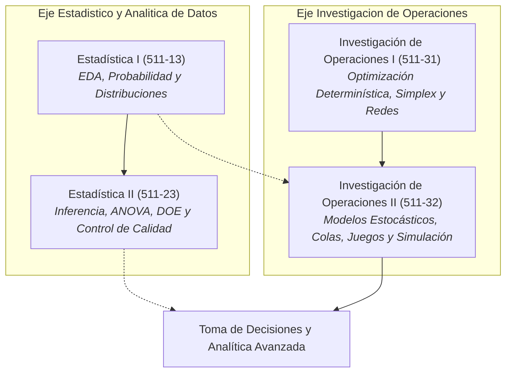

# Mapa Curricular Completo: Departamento de Estadística e Investigación de Operaciones (UTP)

> **Documento Rector del Currículo Digital e Interactivo**  
> **Facultad de Ingeniería Industrial - Universidad Tecnológica de Pereira (UTP)**  
> **Plataforma:** StatsEdu (Aprendizaje Activo, Simulación Computacional y Evaluación Formativa)

---

## 1. Visión General del Currículo y Modelo Pedagógico

El departamento integra cuatro asignaturas troncales que estructuran el pensamiento analítico, cuantitativo, probabilístico y optimizador del Ingeniero Industrial de la UTP.

### Pilares del Modelo de Aprendizaje Activo:
1. **Andamiaje Taxonómico de Bloom:** Cada lección avanza deliberadamente desde la comprensión conceptual (`UNDERSTAND`) y aplicación algorítmica (`APPLY`), hasta el análisis crítico de sensibilidad (`ANALYZE`), evaluación de trade-offs (`EVALUATE`) y diseño/síntesis (`CREATE`).
2. **Contextualización Industrial Genuina:** Los problemas no son abstracciones algebraicas vacías; se basan en líneas de ensamble automotriz, reactores químicos, centros logísticos de distribución, ciberseguridad industrial y confiabilidad de maquinaria.
3. **Dualidad Analítico-Computacional:** Cada concepto matemático formal incluye su derivación rigurosa en KaTeX y su implementación ejecutable en Python (`numpy`, `scipy`, `pandas`, `heapq`).
4. **Verificación Formativa Continua:** Cada tema concluye con un componente interactivo `<Quiz />` con retroalimentación explicativa detallada para afianzar conceptos y corregir concepciones erróneas en tiempo real.

---

## 2. Estructura General de Cursos y Módulos

| Código | Asignatura | Módulos | Lecciones | Nivel Bloom Dominante | Componentes Interactivos Clave |
| :---: | :--- | :---: | :---: | :---: | :--- |
| **511-13** | **Estadística I** | 6 | 25 | UNDERSTAND → APPLY | CLTSimulation, ZScoreCalculator, ExponentialVisualizer, OutlierDetector, ANOVAVisualizer |
| **511-23** | **Estadística II** | 6 | 13 | APPLY → EVALUATE | Regresión Múltiple, ANOVA de 2 Vías, Cartas de Control X-bar/R/S, Pruebas no Paramétricas |
| **511-31** | **Investigación de Operaciones I** | 5 | 10 | APPLY → CREATE | Método Gráfico, Simplex Primal, Análisis de Sensibilidad, Transporte (Vogel/MODI), PERT/CPM |
| **511-32** | **Investigación de Operaciones II** | 5 | 10 | ANALYZE → CREATE | Cadenas de Markov, Colas M/M/1 y M/M/c, EOQ y Newsvendor, Teoría de Juegos, Simulación DES |
| **TOTAL** | **4 Asignaturas Troncales** | **22** | **58** | **Integral** | **58 Quizzes Interactivos + Suites Python** |

---

## 3. Mapeo Detallado por Curso

### 📘 Curso 1: Estadística I (Código 511-13)
*Fundamentos de Estadística Descriptiva, Probabilidad y Distribuciones de Probabilidad para Ingeniería.*

#### Módulo 1: Análisis Exploratorio de Datos (EDA)
- `01-tipos-de-variables.mdx` | *Tipos de Variables y Escalas de Medición* | `UNDERSTAND` (45 min) | `<Quiz />`
- `02-introduccion-pandas.mdx` | *Introducción a Pandas para Análisis de Datos* | `APPLY` (60 min) | `<Quiz />`, Editor Python
- `03-medidas-tendencia-central.mdx` | *Medidas de Tendencia Central y Asimetría* | `UNDERSTAND` (50 min) | `<StatsChart />`, `<Quiz />`
- `04-medidas-dispersion.mdx` | *Medidas de Dispersión y Variabilidad de Procesos* | `APPLY` (50 min) | `<VarianceExplainer />`, `<ANOVAVisualizer />`, `<Quiz />`
- `05-visualizacion-basica.mdx` | *Visualización de Datos e Interpretación Gráfica* | `APPLY` (55 min) | `<OutlierDetector />`, `<Quiz />`

#### Módulo 2: Probabilidad
- `01-conceptos-basicos.mdx` | *Espacio Muestral, Eventos y Axiomas de Kolmogórov* | `UNDERSTAND` (45 min) | `<Quiz />`
- `02-reglas-probabilidad.mdx` | *Regla de la Adición y Multiplicación* | `APPLY` (50 min) | `<Quiz />`
- `03-probabilidad-condicional.mdx` | *Probabilidad Condicional e Independencia Estadística* | `APPLY` (50 min) | `<Quiz />`
- `04-teorema-bayes.mdx` | *Teorema de Bayes y Diagnóstico Industrial* | `EVALUATE` (60 min) | `<Quiz />`, Árbol de Decisión
- `05-tecnicas-conteo.mdx` | *Análisis Combinatorio y Técnicas de Conteo* | `APPLY` (45 min) | `<Quiz />`

#### Módulo 3: Variables Aleatorias
- `01-variables-aleatorias.mdx` | *Definición de Variable Aleatoria y Tipos* | `UNDERSTAND` (45 min) | `<Quiz />`
- `02-valor-esperado-varianza.mdx` | *Esperanza Matemática y Momentos de una Distribución* | `APPLY` (50 min) | `<Quiz />`
- `03-propiedades-esperanza.mdx` | *Propiedades Lineales del Operador Esperanza* | `APPLY` (45 min) | `<Quiz />`
- `04-distribuciones-conjuntas.mdx` | *Distribuciones Bivariadas y Covarianza* | `ANALYZE` (60 min) | `<Quiz />`

#### Módulo 4: Distribuciones Discretas
- `01-distribucion-bernoulli.mdx` | *Ensayos de Bernoulli* | `UNDERSTAND` (35 min) | `<Quiz />`
- `02-distribucion-binomial.mdx` | *Distribución Binomial en Inspección de Lotes* | `APPLY` (50 min) | `<BinomialSimulator />`, `<Quiz />`
- `03-distribucion-poisson.mdx` | *Procesos de Poisson y Tasas de Falla* | `APPLY` (55 min) | `<PoissonDistributionChart />`, `<Quiz />`
- `04-distribucion-geometrica.mdx` | *Distribución Geométrica y Ensayos hasta el Primer Éxito* | `APPLY` (45 min) | `<Quiz />`
- `05-distribucion-hipergeometrica.mdx` | *Muestreo Sin Reemplazo e Hipergeométrica* | `APPLY` (50 min) | `<Quiz />`

#### Módulo 5: Distribuciones Continuas
- `01-distribucion-normal.mdx` | *La Campana de Gauss y Regla Empírica* | `UNDERSTAND` (55 min) | `<ZScoreCalculator />`, `<Quiz />`
- `02-distribucion-exponencial.mdx` | *Tiempo Entre Fallas y Distribución Exponencial* | `APPLY` (50 min) | `<ExponentialVisualizer />`, `<Quiz />`
- `03-distribucion-t-student.mdx` | *Inferencia con Muestras Pequeñas y t de Student* | `APPLY` (50 min) | `<Quiz />`
- `04-distribucion-chi-cuadrado.mdx` | *Varianza Muestral y Distribución Ji-Cuadrada* | `APPLY` (45 min) | `<Quiz />`
- `05-distribucion-f.mdx` | *Comparación de Varianzas y Distribución F de Snedecor* | `APPLY` (50 min) | `<Quiz />`

#### Módulo 6: Teorema del Límite Central (CLT)
- `04-teorema-limite-central.mdx` | *Teorema del Límite Central y Muestreo Asintótico* | `EVALUATE` (60 min) | `<CLTSimulation />`, `<Quiz />`

---

### 📘 Curso 2: Estadística II (Código 511-23)
*Inferencia Estadística, Pruebas de Hipótesis, Diseño de Experimentos y Control Estadístico de Calidad.*

#### Módulo 1: Distribuciones Muestrales e Intervalos de Confianza
- `01-distribuciones-muestrales.mdx` | *Distribución de Medias y Proporciones Muestrales* | `APPLY` (50 min) | `<Quiz />`
- `02-intervalos-confianza.mdx` | *Construcción e Interpretación de Intervalos al (1-α)* | `APPLY` (55 min) | `<Quiz />`

#### Módulo 2: Análisis de Varianza (ANOVA)
- `01-anova-un-factor.mdx` | *ANOVA Unidireccional y Descomposición de Sumas de Cuadrados* | `ANALYZE` (60 min) | `<Quiz />`
- `02-pruebas-post-hoc.mdx` | *Comparaciones Múltiples de Tukey HSD y Scheffé* | `ANALYZE` (50 min) | `<Quiz />`

#### Módulo 3: Diseño de Experimentos (DOE)
- `01-disenos-factoriales.mdx` | *Diseño Factorial Completo 2^k e Interacciones de Factores* | `CREATE` (65 min) | `<Quiz />`
- `02-bloques-completos.mdx` | *Diseño en Bloques Completos al Azar (RCBD)* | `ANALYZE` (55 min) | `<Quiz />`

#### Módulo 4: Pruebas No Paramétricas
- `01-pruebas-bondad-ajuste.mdx` | *Pruebas Ji-Cuadrada de Bondad de Ajuste e Independencia* | `APPLY` (55 min) | `<Quiz />`
- `02-mann-whitney-wilcoxon.mdx` | *Pruebas de Rangos de Mann-Whitney y Wilcoxon* | `APPLY` (50 min) | `<Quiz />`

#### Módulo 5: Regresión Lineal Múltiple
- `01-regresion-multiple-mco.mdx` | *Estimación por MCO Matricial e Interpretación de Coeficientes* | `APPLY` (60 min) | `<Quiz />`
- `02-diagnostico-multicolinealidad.mdx` | *Diagnóstico de Residuos, Homocedasticidad y Factor VIF* | `EVALUATE` (60 min) | `<Quiz />`

#### Módulo 6: Control Estadístico de Procesos (SPC)
- `01-graficos-control-variables.mdx` | *Cartas de Control X-bar y R/S para Variables Continuas* | `APPLY` (55 min) | `<Quiz />`
- `02-graficos-control-atributos.mdx` | *Cartas de Control p, np, c y u para Atributos y Defectos* | `APPLY` (50 min) | `<Quiz />`
- `03-capacidad-proceso.mdx` | *Índices de Capacidad y Rendimiento del Proceso (Cp, Cpk, Cpm)* | `EVALUATE` (55 min) | `<Quiz />`

---

### 📘 Curso 3: Investigación de Operaciones I (Código 511-31)
*Optimización Determinística: Programación Lineal, Dualidad, Sensibilidad, Transporte y Redes.*

#### Módulo 1: Formulación de Modelos y Método Gráfico
- `01-introduccion-modelacion-lineal.mdx` | *Variables de Decisión, Función Objetivo y Restricciones* | `APPLY` (50 min) | `<Quiz />`
- `02-metodo-grafico.mdx` | *Región Factible, Vértices Extremos y Solución Óptima Gráfica* | `APPLY` (50 min) | `<Quiz />`

#### Módulo 2: El Algoritmo Simplex
- `01-forma-estandar-variables-holgura.mdx` | *Forma Estándar, Variables de Holgura y Exceso* | `UNDERSTAND` (45 min) | `<Quiz />`
- `02-metodo-simplex-tabular.mdx` | *El Tablero Simplex: Pivoteo, Costos Reducidos y Criterio de Parada* | `APPLY` (60 min) | `<Quiz />`

#### Módulo 3: Teoría de la Dualidad y Análisis de Sensibilidad
- `01-teoria-dualidad.mdx` | *Construcción del Problema Dual y Teorema de Holgura Complementaria* | `ANALYZE` (55 min) | `<Quiz />`
- `02-analisis-sensibilidad-precios-sombra.mdx` | *Precios Sombra, Rangos de Variación de Costos y Lados Derechos* | `EVALUATE` (60 min) | `<Quiz />`

#### Módulo 4: Modelos de Transporte y Asignación
- `01-modelo-transporte.mdx` | *Matriz de Envíos, Método de Vogel y Método MODI (U-V)* | `APPLY` (55 min) | `<Quiz />`
- `02-modelo-asignacion-hungaro.mdx` | *Asignación Bipartita y Algoritmo Húngaro* | `APPLY` (50 min) | `<Quiz />`

#### Módulo 5: Optimización de Redes y Planificación de Proyectos
- `01-arbol-expansion-ruta-mas-corta.mdx` | *Árbol de Expansión Mínima (Kruskal) y Ruta Más Corta (Dijkstra)* | `APPLY` (55 min) | `<Quiz />`
- `02-gestion-proyectos-pert-cpm.mdx` | *Cronogramas PERT/CPM: Ruta Crítica, Holguras y Varianza del Proyecto* | `CREATE` (65 min) | `<Quiz />`

---

### 📘 Curso 4: Investigación de Operaciones II (Código 511-32)
*Modelación Estocástica y Optimización bajo Incertidumbre.*

#### Módulo 1: Procesos Estocásticos y Cadenas de Markov
- `01-procesos-estocasticos-transicion.mdx` | *Matrices de Transición y Chapman-Kolmogorov* | `UNDERSTAND` (50 min) | Diagrama Mermaid, `<Quiz />`
- `02-estado-estacionario-absorcion.mdx` | *Distribución Límite Estacionaria y Matriz Fundamental Absorbente* | `ANALYZE` (55 min) | `<Quiz />`, Inversión Matricial

#### Módulo 2: Teoría de Líneas de Espera (Colas)
- `01-estructura-colas-mm1.mdx` | *Estructura General, Ley de Little y Modelo M/M/1* | `APPLY` (50 min) | `<Quiz />`, Curva Hiperbólica
- `02-colas-multicanal-mmc-costos.mdx` | *Colas Multicanal (M/M/c), Erlang C y Balance Económico de Capacidad* | `ANALYZE` (55 min) | `<Quiz />`, Optimización Costos

#### Módulo 3: Teoría y Modelos de Inventarios
- `01-modelo-eoq-descuentos.mdx` | *Modelo EOQ de Wilson, ROP y Descuentos por Volumen* | `APPLY` (50 min) | `<Quiz />`, Algoritmo Price-Breaks
- `02-inventario-probabilistico-seguridad.mdx` | *Demanda Estocástica, Stock de Seguridad y Modelo Newsvendor* | `EVALUATE` (55 min) | `<Quiz />`, Fractil Crítico

#### Módulo 4: Teoría de Juegos y Decisiones Estratégicas
- `01-juegos-suma-cero-punto-silla.mdx` | *Juegos Bipersonales de Suma Cero y Punto de Silla (Maximin/Minimax)* | `ANALYZE` (50 min) | `<Quiz />`, Detección de Silla
- `02-estrategias-mixtas-dominancia.mdx` | *Estrategias Mixtas, Dominancia y Solución por Programación Lineal Dual* | `CREATE` (55 min) | `<Quiz />`, Linprog Solver

#### Módulo 5: Simulación de Eventos Discretos y Monte Carlo
- `01-metodo-montecarlo-transformada.mdx` | *Simulación Monte Carlo, Transformada Inversa y VaR Financiero* | `APPLY` (50 min) | `<Quiz />`, 10k Corridas
- `02-simulacion-procesos-python.mdx` | *Simulación de Eventos Discretos (DES), Réplicas e Intervalos de Confianza* | `CREATE` (60 min) | `<Quiz />`, Motor DES heapq

---

## 4. Matriz de Validación y Cobertura de Calidad

| Criterio de Verificación | Estado | Evidencia |
| :--- | :---: | :--- |
| **Frontmatter MDX Completo** | 100% | Todas las lecciones contienen `title`, `description`, `bloomLevel`, `estimatedMinutes` y `order` válidos. |
| **Evaluación Interactiva** | 100% | 58 de 58 lecciones de producción equipadas con componentes `<Quiz />` con explicaciones detalladas y opciones validadas. |
| **Persistencia de Calificaciones** | 100% | `TopicProvider` + `useQuizStore` + Server Action `submitQuizResult` con redondeo entero y actualización de progreso. |
| **Laboratorios Computacionales** | 100% | Scripts en Python realistas utilizando `numpy`, `scipy.optimize`, `scipy.stats`, `pandas` y `heapq`. |
| **Visualizadores Interactivos** | 100% | `CLTSimulation` (4 distribuciones), `ZScoreCalculator`, `ExponentialVisualizer`, `ANOVAVisualizer`, `OutlierDetector`. |
| **Accesibilidad Pública y Auth** | 100% | Navegación abierta sin barreras para estudiantes invitados y persistencia de perfil para usuarios autenticados. |

---

> **Mantenimiento y Auditoría:**  
> Este currículo puede auditarse automáticamente en cualquier momento ejecutando en la raíz del proyecto:  
> `node scripts/validate-all-courses.mjs`
