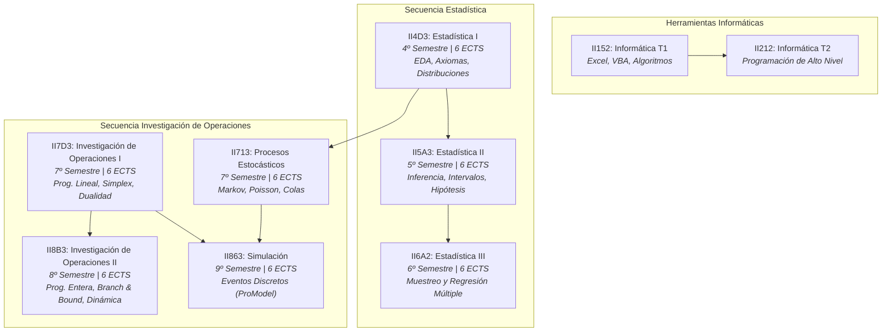
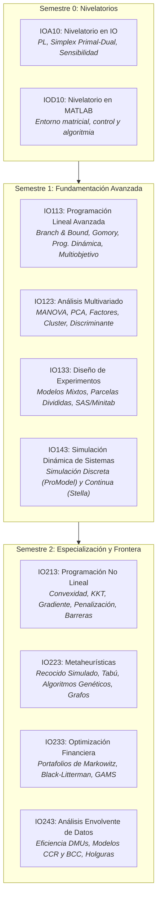

# Planes de Estudio y Malla Curricular Oficial: Área de Investigación de Operaciones y Estadística

> **Facultad de Ingeniería Industrial — Universidad Tecnológica de Pereira (UTP)**  
> **Área Académica:** Investigación de Operaciones y Estadística  
> **Laboratorio de Apoyo:** GEIO (Grupo de Estudios en Investigación de Operaciones y Laboratorio de Simulación)  
> **Documento Oficial de Referencia Curricular y Mapeo Formativo**

---

## 1. Presentación Institucional y Autoridades Académicas

La formación analítica y cuantitativa de la Facultad de Ingeniería Industrial de la **Universidad Tecnológica de Pereira (UTP)** se fundamenta en el pensamiento riguroso de modelado matemático, la inferencia estadística, la analítica predictiva y la optimización prescriptiva de sistemas sociotécnicos y productivos.

### Equipo Directivo y Coordinación Académica
* **Dirección de Programa de Pregrado (Ingeniería Industrial):** Ing. Wilson Arenas Valencia.
* **Dirección de Posgrado (Maestría en Investigación Operativa y Estadística - MIOE):** Dr. José A. Soto Mejía.
* **Cuerpo Docente y Coordinadores de Asignatura:**
  - **Dra. Eliana Mirledy Toro Ocampo:** Coordinadora de *Investigación de Operaciones II*, *Procesos Estocásticos* y *Programación Lineal Avanzada*.
  - **Dr. Antonio Hernando Escobar Zuluaga:** Coordinador de *Programación No Lineal*.
  - **Dr. José A. Soto Mejía:** Coordinador de *Estadística II*, *Simulación*, *Simulación Dinámica de Sistemas* y *Análisis Envolvente de Datos (DEA)*.
  - **Prof. César Augusto Zapata:** Coordinador de *Estadística I* y *Estadística III*.
  - **Ing. Natalia Bohórquez Bedoya:** Coordinadora de *Investigación de Operaciones I*.
  - **Dra. María Elena Bernal Loaiza:** Coordinadora del ciclo computacional básico (*Informática T1* e *Informática T2*).
  - **Dr. Mauricio Granada Echeverri:** Coordinador de *Metaheurísticas*.
  - **Dr. Carlos Osorio Ramírez:** Coordinador de *Optimización Financiera*.
  - **Mg. Jairo Alfonso Clavijo Méndez:** Coordinador de *Análisis Multivariado*.
  - **Prof. Oscar Gómez Carmona:** Coordinador del curso nivelatorio *Matlab*.

### Laboratorio GEIO (Gestión y Estudios en Investigación de Operaciones)
El **Laboratorio GEIO** constituye el centro de experimentación computacional, optimización y simulación de la Facultad. Proporciona infraestructura tecnológica avanzada y soporte de software especializado para pregrado y posgrado:
* **Entornos de Optimización y Modelado:** AMPL, GAMS, solver CPLEX/Gurobi, Python (`scipy.optimize`, `pulp`, `pyomo`), MATLAB.
* **Entornos de Analítica y Estadística:** R / RStudio, Python (`pandas`, `numpy`, `statsmodels`, `scikit-learn`), Minitab, SAS University Edition.
* **Entornos de Simulación:** ProModel (Simulación de Eventos Discretos) y Stella (Dinámica de Sistemas Continuos).
* **Misión Formativa:** Vincular la teoría matemática con la toma de decisiones en planta, logística, cadenas de abastecimiento, confiabilidad industrial y sistemas financieros.

---

## 2. Malla Curricular Oficial de Pregrado: Área de IO y Estadística

El plan de estudios de Ingeniería Industrial estructura una trayectoria secuencial desde los fundamentos computacionales y probabilísticos hasta la optimización estocástica y la simulación computacional de eventos discretos.

### Detalle de Asignaturas Troncales de Pregrado

| Código | Asignatura Oficial | Semestre | Créditos ECTS | Coordinador Responsable | Núcleo Temático y Software |
| :---: | :--- | :---: | :---: | :--- | :--- |
| **II152** | **Informática T1** | 1º (Año 1) | 6 ECTS | María Elena Bernal Loaiza | Análisis de datos en hoja electrónica Excel, formulación matemática y automatización mediante Visual Basic for Applications (VBA). |
| **II212** | **Informática T2** | 2º (Año 1) | 6 ECTS | María Elena Bernal Loaiza | Estructuras de datos, algoritmia y programación estructurada/orientada a objetos en lenguajes de alto nivel orientados a ingeniería. |
| **II4D3** | **Estadística I** | 4º (Año 2) | 6 ECTS | César Augusto Zapata | Álgebra booleana, axiomas de Kolmogórov, probabilidad condicional, Teorema de Bayes, distribuciones discretas (Binomial, Poisson, Hipergeométrica) y continuas (Normal, Exponencial), EDA y estadística descriptiva. |
| **II5A3** | **Estadística II** | 5º (Año 3) | 6 ECTS | José Soto Mejía | Distribuciones muestrales, Teorema del Límite Central, estimación puntual y por intervalos de confianza (medias, varianzas, proporciones), pruebas de hipótesis paramétricas (una y dos poblaciones), pruebas no paramétricas (Signos, Wilcoxon, Kruskal-Wallis). |
| **II6A2** | **Estadística III** | 6º (Año 3) | 6 ECTS | César Augusto Zapata | Teoría del muestreo: M.A. Simple, Estratificado, Sistemático y por Conglomerados. Análisis de regresión lineal simple y múltiple, multicolinealidad, validación de supuestos de residuos en R y Excel. |
| **II7D3** | **Investigación de Operaciones I** | 7º (Año 3) | 6 ECTS | Natalia Bohórquez Bedoya | Formulación de modelos de programación lineal, método gráfico 2D, algoritmo Simplex primal y dual, condiciones KKT, análisis de sensibilidad post-óptimo, modelos de transporte, transbordo y asignación, redes y PERT/CPM. |
| **II713** | **Procesos Estocásticos** | 7º (Año 4) | 6 ECTS | Eliana Mirledy Toro Ocampo | Variables aleatorias y procesos temporales, cadenas de Markov en tiempo discreto y continuo, matrices de transición, estados absorbentes y recurrentes, procesos de nacimiento y muerte, modelos de líneas de espera (colas). |
| **II8B3** | **Investigación de Operaciones II** | 8º (Año 4) | 6 ECTS | Eliana Mirledy Toro Ocampo | Programación lineal entera pura, mixta y binaria ($0-1$), algoritmo de Ramificación y Acotamiento (*Branch and Bound*), cortes hiperplanares de Gomory, programación dinámica determinística y probabilística, introducción a metaheurísticas. |
| **II863** | **Simulación** | 9º (Año 5) | 6 ECTS | José Soto Mejía | Fundamentos de simulación por eventos discretos, generación de números pseudoaleatorios y variables aleatorias, pruebas de bondad de ajuste ($\chi^2$, Kolmogorov-Smirnov), modelado y experimentación de sistemas en software ProModel. |

---

## 3. Malla Oficial de Posgrado: Maestría en Investigación Operativa y Estadística (MIOE)

La **Maestría en Investigación Operativa y Estadística (MIOE)**, adscrita a la Facultad de Ingeniería Industrial y dirigida por el Dr. José A. Soto Mejía, profundiza en las fronteras de la optimización matemática avanzada, el análisis estadístico multivariante y la modelación sistémica.

### Detalle de Cursos de Maestría (MIOE)

#### Semestre 0: Ciclo Nivelatorio
* **`IOA10` — Nivelatorio en Investigación de Operaciones**
  - **Coordinadora:** Dra. Eliana Mirledy Toro Ocampo
  - **Objetivo:** Homogeneizar los fundamentos en formulación matemática de problemas lineales, resolución mediante el algoritmo Simplex primal y dual, y lectura e interpretación gerencial de la tabla de análisis de sensibilidad.
  - **Bibliografía Clave:** Taha (2004), Hillier & Lieberman (2010), Gallego Rendón et al. (2007).
* **`IOD10` — Nivelatorio en MATLAB**
  - **Coordinador:** Prof. Oscar Gómez Carmona
  - **Objetivo:** Desarrollar destreza en el entorno matricial de programación MATLAB, creación de funciones vectorizadas, control de flujo y desarrollo de algoritmos numéricos y de búsqueda exacta.

#### Semestre 1: Tronco Avanzado
* **`IO113` — Programación Lineal Avanzada**
  - **Coordinadora:** Dra. Eliana Mirledy Toro Ocampo
  - **Objetivos:** Formular e implementar modelos lineales enteros (puros, mixtos y binarios); dominar la teoría y álgebra de *Branch and Bound*; derivar cortes fraccionales de Gomory; resolver problemas mediante Programación Dinámica (reemplazo de equipos, asignación de carga, mochila); formular programación por metas lexicográficas y multiobjetivo vía $\epsilon$-Constraint; e introducir la optimización estocástica de dos etapas.
  - **Software:** AMPL / GAMS / CPLEX.
  - **Bibliografía Clave:**
    - Gallego Rendón, R., Escobar Zuluaga, A., Romero Lázaro, R. (2007). *Programación lineal entera*. Universidad Tecnológica de Pereira.
    - Hillier, F. S., & Lieberman, G. J. (2010). *Introduction to Operations Research*. McGraw-Hill.
    - Birge, J. R., & Louveaux, F. (2011). *Introduction to Stochastic Programming*. Springer.
* **`IO123` — Análisis Multivariado**
  - **Coordinador:** Mg. Jairo Alfonso Clavijo Méndez
  - **Objetivos:** Extender la inferencia a vectores de medias y matrices de covarianzas poblacionales; probar hipótesis mediante MANOVA; reducir la dimensionalidad conservando la máxima variabilidad mediante Componentes Principales (PCA) y Análisis Factorial; clasificar y agrupar observaciones mediante Análisis de Conglomerados (*Cluster Analysis*) y Análisis Discriminante lineal/cuadrático; e interpretar relaciones canónicas.
  - **Software:** R, MATLAB, SAS University Edition.
  - **Bibliografía Clave:**
    - Johnson, R. A., & Wichern, D. W. (1992/2007). *Applied Multivariate Statistical Analysis*. Prentice Hall.
    - Rencher, A. C. (1998). *Multivariate Statistical Inference and Applications*. John Wiley & Sons.
    - Peña, D. (2002). *Análisis de datos multivariantes*. McGraw-Hill.
* **`IO133` — Diseño de Experimentos (DOE)**
  - **Objetivos:** Diseñar y evaluar esquemas experimentales multifactoriales avanzados, modelos de efectos fijos, aleatorios y mixtos; analizar diseños en parcelas divididas (*split-plot*), franjas divididas y bloques incompletos; implementar la metodología de Van Hiele para la estructuración conceptual y análisis riguroso de sumas de cuadrados tipo I-IV.
  - **Software:** Minitab, SAS for Mixed Models.
  - **Bibliografía Clave:**
    - Montgomery, D. C. (2004). *Diseño y Análisis de Experimentos*. Limusa Wiley.
    - Little, R. C. et al. (2006). *SAS for Mixed Models*. SAS Institute.
    - Kuehl, R. O. (2001). *Diseño de Experimentos*. Thomson Learning.
* **`IO143` — Simulación de la Dinámica de Sistemas**
  - **Coordinador:** Dr. José A. Soto Mejía
  - **Objetivos:** Modelar e integrar los dos paradigmas principales de simulación: simulación estocástica de eventos discretos para procesos de colas y logística (ProModel) y simulación continua de retroalimentación de bucles causales para planeación estratégica y políticas industriales (Stella / Vensim).
  - **Software:** ProModel, Stella.
  - **Bibliografía Clave:** Sterman, J. D. (2000) *Business Dynamics*; Law, A. M. (2007) *Simulation Modeling and Analysis*.

#### Semestre 2: Especialización de Frontera
* **`IO213` — Programación No Lineal**
  - **Coordinador:** Dr. Antonio Hernando Escobar Zuluaga
  - **Objetivos:** Desarrollar la base analítica de la optimización matemática no lineal continua; caracterización de conjuntos y funciones convexas/cóncavas; derivación e interpretación geométrica de las condiciones de optimalidad de primer y segundo orden de Karush-Kuhn-Tucker (KKT); dualidad Lagrangiana; algoritmos de gradiente descendente, Newton-Raphson, métodos cuasi-Newton y algoritmos de barrera y penalización secuencial no restringida (SUMT).
  - **Bibliografía Clave:**
    - Bazaraa, M. S., Sherali, H. D., & Shetty, C. M. (2006). *Nonlinear Programming: Theory and Algorithms*. John Wiley & Sons.
    - Luenberger, D. G., & Ye, Y. (1984/2008). *Linear and Nonlinear Programming*. Springer / Addison-Wesley.
* **`IO223` — Metaheurísticas**
  - **Coordinador:** Dr. Mauricio Granada Echeverri
  - **Objetivos:** Abordar problemas de optimización combinatoria NP-hard de gran escala (VRP, TSP, Job Shop Scheduling, Asignación Cuadrática); formular algoritmos basados en trayectorias (Recocido Simulado / *Simulated Annealing*, Búsqueda Tabú) y poblacionales (Algoritmos Genéticos, Optimización por Enjambre de Partículas - PSO, Colonia de Hormigas); diseñar operadores de codificación, cruce, mutación y calibración de hiperparámetros.
  - **Bibliografía Clave:** Talbi, E.-G. (2009) *Metaheuristics: From Design to Implementation*; Glover, F. & Kochenberger, G. A. (2003) *Handbook of Metaheuristics*.
* **`IO233` — Optimización Financiera**
  - **Coordinador:** Dr. Carlos Osorio Ramírez
  - **Objetivos:** Aplicar programación cuadrática, estocástica y dinámica a la ingeniería financiera y gestión de portafolios; formulación clásica del modelo de varianza media de Harry Markowitz; frontera eficiente con y sin activo libre de riesgo; modelos de factores (Sharpe / CAPM); gestión del riesgo con Value at Risk (VaR) y Conditional VaR (CVaR).
  - **Software:** GAMS, MATLAB, Python.
  - **Bibliografía Clave:**
    - Luenberger, D. G. (1998). *Investment Science*. Oxford University Press.
    - Winston, W. L. (2002). *Financial Models Using Simulation and Optimization*. Palisade Corp.
    - Zenios, S. A. (2008). *Practical Financial Optimization*. Wiley-Blackwell.
* **`IO243` — Análisis Envolvente de Datos (DEA)**
  - **Coordinador:** Dr. José A. Soto Mejía
  - **Objetivos:** Evaluar la eficiencia técnica y de escala de Unidades de Toma de Decisiones (DMUs) que transforman múltiples insumos en múltiples productos; formulación primal y dual de los modelos CCR (Charnes, Cooper, Rhodes - rendimientos constantes a escala) y BCC (Banker, Charnes, Cooper - rendimientos variables a escala); determinación de la frontera de eficiencia, proyecciones radiales y cálculo de holguras (*slacks*).
  - **Software:** DEA-Solver, R (paquetes `Benchmarking` y `nonparaeff`).
  - **Bibliografía Clave:** Cooper, W. W., Seiford, L. M., & Tone, K. (2007). *Data Envelopment Analysis: A Comprehensive Text with Models, Applications, References and DEA-Solver Software*. Springer.

---

## 4. Obras Fundamentales y Bibliografía Institucional UTP

La producción bibliográfica propia de los docentes e investigadores del área en la UTP es un pilar formativo característico:

1. **Textos de Referencia Institucional UTP:**
   - **Gallego Rendón, R. A., Escobar Zuluaga, A. H., & Toro Ocampo, E. M.** (2007). *Programación lineal y flujo de redes*. Universidad Tecnológica de Pereira.
   - **Gallego Rendón, R. A., Escobar Zuluaga, A. H., & Romero Lázaro, R.** (2007). *Programación lineal entera*. Colección Textos Académicos, Universidad Tecnológica de Pereira.
   - **López Rendón, R. F.** (2010). *Modelación y Simulación de Sistemas Discretos*. Postergraph S.A., Pereira. ISBN: 978-958-44-6516-0.
2. **Textos Clásicos Internacionales:**
   - **Taha, Hamdy A.** (2004/2012). *Investigación de Operaciones*. Pearson Educación.
   - **Hillier, Frederick S. & Lieberman, Gerald J.** (2010). *Introducción a la Investigación de Operaciones*. McGraw-Hill Education.
   - **Walpole, Ronald E., Myers, Raymond H., Myers, Sharon L., & Ye, Keying.** (2007/2012). *Probabilidad y Estadística para Ingenieros y Ciencias*. Pearson Educación.
   - **Bazaraa, Mokhtar S., Jarvis, John J., & Sherali, Hanif D.** (2010). *Linear Programming and Network Flows*. John Wiley & Sons.
   - **Montgomery, Douglas C. & Runger, George C.** (2010). *Probabilidad y Estadística Aplicadas a la Ingeniería*. Limusa Wiley.

---

## 5. Articulación con la Plataforma Digital StatsEdu

La plataforma **StatsEdu** digitaliza este currículo oficial combinando:
1. **Transparencia Curricular:** Alineación exacta de cada lección interactiva con los objetivos de aprendizaje (RA) y códigos de asignatura UTP (II4D3, II5A3, II6A2, II7D3, II8B3, II713, II863).
2. **Interactividad Visual:** Integración de componentes reactivos para experimentar visualmente con regiones factibles, vectores gradientes, zonas críticas de contraste de hipótesis, árboles de probabilidad y simulaciones Monte Carlo.
3. **Ejecución Computacional en el Cliente:** Consolas Python basadas en Pyodide (WebAssembly) para reproducir los ejercicios numéricos sin dependencias externas de servidores.
