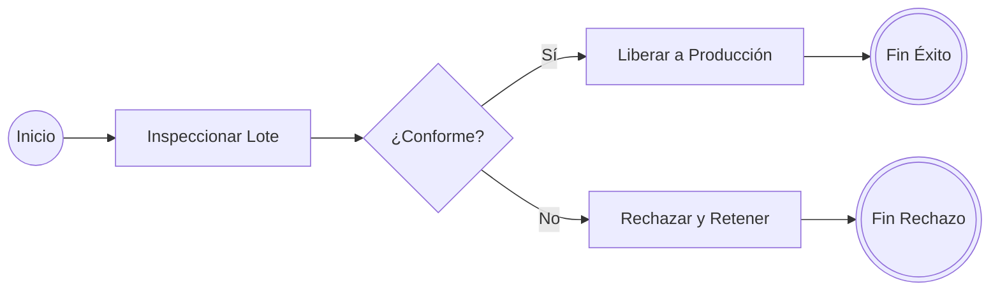

# Introducción

> "Si no puedes describir lo que estás haciendo como un proceso, no sabes lo que estás haciendo". Esta célebre sentencia de W. Edwards Deming fundamenta la **Gestión por Procesos de Negocio (BPM - Business Process Management)**. Las organizaciones tradicionales fragmentadas en silos funcionales (compras, producción, finanzas, ventas) generan retrasos crónicos en las fronteras departamentales.

El modelado formal mediante el estándar internacional **BPMN 2.0 (Business Process Model and Notation)** permite a los ingenieros industriales documentar, analizar, simular y automatizar flujos operativos con rigor visual inequívoco.

<Callout type="info">
**Piscinas (Pools) y Carriles (Lanes):** Una piscina representa a una organización o entidad participante independiente (e.g. Proveedor vs Empresa). Los carriles dentro de una piscina subdividen las responsabilidades por áreas internas o roles (e.g. Almacén, Control de Calidad, Producción).
</Callout>

## Objetivos de Aprendizaje
- Aplicar la metodología SIPOC para delimitar el alcance de un proceso industrial.
- Diferenciar los elementos fundamentales de BPMN 2.0: Eventos (inicio, intermedio, fin), Actividades, Compuertas y Flujos.
- Modelar compuertas lógicas: Exclusiva (XOR), Paralela (AND) e Inclusiva (OR).
- Analizar cuellos de botella y tiempos de ciclo de un proceso modelado en Python.

---

# Fundamentos Teóricos

### Elementos Básicos de BPMN 2.0



1. **Eventos (Círculos):**
   - *Inicio:* Línea simple fina. Desencadena el proceso.
   - *Intermedio:* Doble línea concéntrica. Ocurre durante la ejecución (e.g. captura de mensaje, temporizador).
   - *Fin:* Línea gruesa continua. Concluye una trayectoria del proceso.

2. **Actividades (Rectángulos con bordes redondeados):**
   Unidades de trabajo ejecutadas por personas o sistemas (Tarea humana, Tarea de servicio automática).

3. **Compuertas (Rombos / Gateways):**
   - **Exclusiva basada en datos (XOR - 'X'):** Bifurcación mutuamente excluyente. Se elige exactamente un camino.
   - **Paralela (AND - '+'):** Divide el flujo en múltiples ramas concurrentes sin evaluar condiciones, o sincroniza múltiples ramas antes de continuar.
   - **Inclusiva (OR - 'O'):** Activa una o más ramas dependiendo de múltiples condiciones no excluyentes.

---

# Laboratorio en Python: Análisis de Capacidad y Tiempos de Flujo en Red BPMN

```python
import pandas as pd
import numpy as np

# Modelo de proceso de Despacho de Pedidos Industriales:
# Flujo con bifurcaciones paralelas y exclusivas
procesos = pd.DataFrame([
    {'Actividad': '1. Recepción y Validación de Orden', 'Tiempo_Medio_min': 12.0, 'Capacidad_unid_h': 15.0},
    {'Actividad': '2A. Picking en Bodega (Paralelo)', 'Tiempo_Medio_min': 25.0, 'Capacidad_unid_h': 10.0},
    {'Actividad': '2B. Facturación y Crédito (Paralelo)', 'Tiempo_Medio_min': 18.0, 'Capacidad_unid_h': 12.0},
    {'Actividad': '3. Control de Calidad y Embalaje', 'Tiempo_Medio_min': 20.0, 'Capacidad_unid_h': 8.0}, # Cuello de botella
    {'Actividad': '4. Despacho a Transporte', 'Tiempo_Medio_min': 10.0, 'Capacidad_unid_h': 20.0}
])

# Identificación del Cuello de Botella del Proceso (Teoría de Restricciones - TOC)
indice_cuello = procesos['Capacidad_unid_h'].idxmin()
cuello_botella = procesos.loc[indice_cuello]
capacidad_maxima_sistema = cuello_botella['Capacidad_unid_h']

# Tiempo de Ciclo de Ruta Crítica:
# 1 -> max(2A, 2B) [por compuerta paralela AND] -> 3 -> 4
t_ruta_critica = (
    procesos.loc[0, 'Tiempo_Medio_min'] +
    max(procesos.loc[1, 'Tiempo_Medio_min'], procesos.loc[2, 'Tiempo_Medio_min']) +
    procesos.loc[3, 'Tiempo_Medio_min'] +
    procesos.loc[4, 'Tiempo_Medio_min']
)

print("ANÁLISIS DE CAPACIDAD Y TIEMPOS DEL MODELO BPMN:")
print(procesos.to_string(index=False))
print(f"\n--> CUELLO DE BOTELLA IDENTIFICADO: {cuello_botella['Actividad']}")
print(f"--> Capacidad Máxima del Proceso Completo: {capacidad_maxima_sistema:.1f} órdenes/hora")
print(f"--> Tiempo de Flujo en Ruta Crítica (Lead Time Mínimo): {t_ruta_critica:.1f} minutos")
```

---

# Autoevaluación

<Quiz
  title="Quiz: Modelamiento de Procesos BPMN 2.0"
  questions={[
    {
      id: "q_bpmn_1",
      text: "Si dos tareas se originan a partir de una compuerta paralela (AND / Parallel Gateway), ¿cuándo podrá continuar la compuerta de sincronización posterior?",
      options: [
        { id: "a", text: "Únicamente cuando ambas actividades paralelas hayan finalizado de forma completa", isCorrect: true, explanation: "La compuerta AND de unión (join) espera a que todos los hilos de ejecución concurrentes lleguen a ella antes de liberar el flujo siguiente." },
        { id: "b", text: "Tan pronto como la primera de ellas termine", isCorrect: false, explanation: "Eso correspondería a una compuerta compleja o carrera condicional." },
        { id: "c", text: "Nunca, se genera un bloqueo de interbloqueo (deadlock)", isCorrect: false, explanation: "Si el modelo está bien balanceado, la sincronización AND es la práctica estándar." }
      ]
    },
    {
      id: "q_bpmn_2",
      text: "En un diagrama BPMN, ¿qué elemento gráfico representa que un mensaje viaja entre dos piscinas (organizaciones) distintas?",
      options: [
        { id: "a", text: "Línea punteada con flecha abierta (Flujo de Mensaje / Message Flow)", isCorrect: true, explanation: "Las líneas sólidas (Sequence Flow) solo pueden conectar elementos dentro de una misma piscina; la interacción entre participantes externos se modela estrictamente con Flujos de Mensaje punteados." },
        { id: "b", text: "Línea continua gruesa", isCorrect: false, explanation: "La línea continua es el flujo de secuencia interno." },
        { id: "c", text: "Un círculo rojo sólido", isCorrect: false, explanation: "Es un evento de terminación de proceso." }
      ]
    }
  ]}
/>
