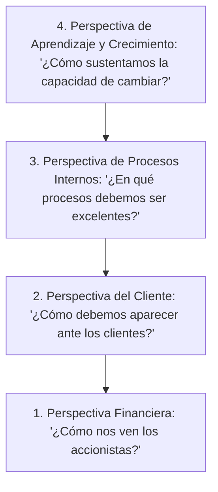

# Introducción

> "Lo que no se mide, no se puede controlar; lo que no se controla, no se puede gestionar; y lo que no se gestiona, no se puede mejorar". El aforismo de Lord Kelvin adquiere dimensión operativa en el diseño de **Indicadores Clave de Desempeño (KPIs - Key Performance Indicators)**.

A finales del siglo XX, Robert Kaplan y David Norton evidenciaron que la gestión empresarial guiada exclusivamente por métricas contables tradicionales (como el ROI o la utilidad neta) era equivalente a conducir un automóvil mirando únicamente por el espejo retrovisor. El **Cuadro de Mando Integral (CMI / Balanced Scorecard)** proporciona una visión holística y multidimensional.

<Callout type="info">
**Causalidad Estratégica:** El CMI no es una lista dispersa de indicadores; es un mapa de hipótesis de causa-efecto: *Si invertimos en capacitar a los ingenieros (Aprendizaje), optimizaremos los tiempos de ciclo y calidad (Procesos), lo que elevará la satisfacción y retención (Clientes), traduciéndose en mayor rentabilidad económica (Financiera).*
</Callout>

## Objetivos de Aprendizaje
- Estructurar el Mapa Estratégico de una organización en sus 4 perspectivas cardinales.
- Formular matemáticamente KPIs con metas, rangos de semaforización y responsables.
- Diferenciar indicadores de resultado (*Lagging*) de inductores tempranos (*Leading*).
- Implementar un cuadro de mando integral analítico automatizado en Python.

---

# Fundamentos Teóricos

### Las Cuatro Perspectivas del BSC



### Formulación Rigurosa de un KPI

Todo KPI debe definirse mediante una función escalar medible $K(t)$ sujeta a semaforización normalizada de cumplimiento:

$$\text{Cumplimiento (\%)} = \begin{cases} 
\frac{\text{Valor Real}}{\text{Valor Meta}} \times 100, & \text{si el objetivo es maximizar} \\[8pt]
\frac{\text{Valor Meta}}{\text{Valor Real}} \times 100, & \text{si el objetivo es minimizar}
\end{cases}$$

- **Verde:** Cumplimiento $\ge 95\%$.
- **Amarillo:** Cumplimiento entre $85\%$ y $94.9\%$.
- **Rojo:** Cumplimiento $< 85\%$ (requiere plan de acción inmediato).

---

# Laboratorio en Python: Motor Analítico de Cuadro de Mando Integral

```python
import pandas as pd
import numpy as np

# Matriz de Indicadores del Balanced Scorecard para una Planta Industrial
kpis = [
    {
        'Perspectiva': 'Financiera',
        'KPI': 'EBITDA (Millones USD)',
        'Tipo': 'Lagging',
        'Meta': 12.5,
        'Real': 11.8,
        'Direccion': 'Maximizar'
    },
    {
        'Perspectiva': 'Clientes',
        'KPI': 'On-Time In-Full (OTIF %)',
        'Tipo': 'Lagging',
        'Meta': 96.0,
        'Real': 94.2,
        'Direccion': 'Maximizar'
    },
    {
        'Perspectiva': 'Procesos Internos',
        'KPI': 'Eficiencia Global de Equipos (OEE %)',
        'Tipo': 'Leading',
        'Meta': 85.0,
        'Real': 86.4,
        'Direccion': 'Maximizar'
    },
    {
        'Perspectiva': 'Procesos Internos',
        'KPI': 'Tasa de Scrap / Desperdicio (%)',
        'Tipo': 'Leading',
        'Meta': 1.5,
        'Real': 2.1,
        'Direccion': 'Minimizar'
    },
    {
        'Perspectiva': 'Aprendizaje y Crecimiento',
        'KPI': 'Horas Capacitacion Lean / Operario',
        'Tipo': 'Leading',
        'Meta': 40.0,
        'Real': 42.0,
        'Direccion': 'Maximizar'
    }
]

df_kpis = pd.DataFrame(kpis)

# Cálculo de % Cumplimiento
def calcular_cumplimiento(row):
    if row['Direccion'] == 'Maximizar':
        return (row['Real'] / row['Meta']) * 100.0
    else:
        return (row['Meta'] / row['Real']) * 100.0

df_kpis['Cumplimiento_%'] = df_kpis.apply(calcular_cumplimiento, axis=1)

# Semaforización
def semaforo(val):
    if val >= 95.0:
        return 'Verde (Meta Lograda)'
    elif val >= 85.0:
        return 'Amarillo (Alerta)'
    else:
        return 'Rojo (Crítico)'

df_kpis['Semaforo'] = df_kpis['Cumplimiento_%'].apply(semaforo)

print("TABLERO DE CONTROL - BALANCED SCORECARD INDUSTRIAL:")
print(df_kpis[['Perspectiva', 'KPI', 'Meta', 'Real', 'Cumplimiento_%', 'Semaforo']].round(2).to_string(index=False))
```

---

# Autoevaluación

<Quiz
  title="Quiz: KPIs y Cuadro de Mando Integral"
  questions={[
    {
      id: "q_kpi_1",
      text: "Si la meta de Scrap en una fundición es del 1.5% y el resultado real fue del 2.5%, ¿cuál es el porcentaje de cumplimiento del KPI bajo lógica de minimización?",
      options: [
        { id: "a", text: "60% (Cumplimiento = Meta / Real = 1.5 / 2.5 = 60.0% -> Rojo)", isCorrect: true, explanation: "En métricas de minimización (costos, desperdicios, accidentes), superar la meta penaliza el indicador: Meta / Real = 1.5 / 2.5 = 0.60." },
        { id: "b", text: "166.7%", isCorrect: false, explanation: "Calcular Real / Meta aplicaría si el objetivo fuera generar la mayor cantidad de chatarra posible." },
        { id: "c", text: "100%", isCorrect: false, explanation: "No se alcanzó la meta establecida." }
      ]
    },
    {
      id: "q_kpi_2",
      text: "¿Por qué el indicador OEE (Overall Equipment Effectiveness) en la perspectiva de procesos es considerado un 'Leading Indicator' respecto a la perspectiva financiera?",
      options: [
        { id: "a", text: "Porque una mejora en la disponibilidad, rendimiento y calidad de las máquinas anticipa aumentos futuros en ventas y reducción de costos unitarios", isCorrect: true, explanation: "El OEE mide la excelencia en el corazón de la manufactura; su desempeño precede e induce los estados financieros del balance final." },
        { id: "b", text: "Porque se mide en dólares", isCorrect: false, explanation: "El OEE es un porcentaje adimensional." },
        { id: "c", text: "Porque reemplaza a la contabilidad general", isCorrect: false, explanation: "El OEE complementa pero no reemplaza a los estados financieros." }
      ]
    }
  ]}
/>
