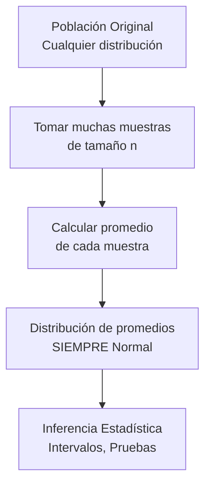

# Introducción

> **El Milagro:** No importa cuál sea la distribución original de tus datos. Si tomas muchas muestras y calculas sus promedios, esos promedios **siempre** seguirán una distribución Normal.

Este es el **Teorema del Límite Central (TLC)**, la piedra angular de toda la estadística inferencial.

<Callout type="info">
**¿Por qué importa?** Gracias al TLC, podemos usar la distribución Normal para hacer inferencias sobre cualquier población, aunque no sea normal.
</Callout>

## Objetivos de Aprendizaje
- Enunciar correctamente el TLC.
- Visualizar la convergencia a la Normal.
- Aplicar el TLC para calcular probabilidades de promedios.

---

# 1. Enunciado Formal

Sea $X_1, X_2, ..., X_n$ una muestra aleatoria de **cualquier** población con:
- Media: $\mu$
- Varianza: $\sigma^2$

Entonces, para $n$ suficientemente grande:

$$\bar{X} \sim N\left(\mu, \frac{\sigma}{\sqrt{n}}\right)$$

O en forma estandarizada:

$$Z = \frac{\bar{X} - \mu}{\sigma / \sqrt{n}} \sim N(0, 1)$$

### Puntos Clave
1. **Cualquier distribución original** (uniforme, exponencial, ¡incluso la más rara!)
2. **n ≥ 30** es la regla práctica (para poblaciones muy asimétricas, más)
3. El **error estándar** $\frac{\sigma}{\sqrt{n}}$ disminuye con más datos

---

# 2. Visualización: La Magia en Acción

Veamos cómo el promedio de datos uniformes (¡claramente NO normales!) converge a una Normal.

<CLTSimulation initialN={1} maxN={50} numSamples={1000} />

<Callout type="note">
**¡Interactúa!** Mueve el slider o haz clic en "Animar Convergencia" para ver cómo la distribución de promedios se convierte en una campana perfecta.
</Callout>

### Simulación con Python

```python
import numpy as np
import matplotlib.pyplot as plt
from scipy.stats import norm

np.random.seed(42)

# Población: Uniforme(0, 1) - MUY distinta de Normal
n_simulaciones = 5000
tamaños = [1, 5, 30, 100]

fig, axes = plt.subplots(2, 2, figsize=(12, 10))

for i, n in enumerate(tamaños):
    ax = axes[i // 2, i % 2]
    
    # Simular n_simulaciones promedios de tamaño n
    promedios = [np.mean(np.random.uniform(0, 1, n)) for _ in range(n_simulaciones)]
    
    # Parámetros teóricos del TLC
    mu_teorico = 0.5  # Media de Uniforme(0,1)
    sigma_teorico = (1/12)**0.5 / np.sqrt(n)  # Error estándar
    
    # Histograma
    ax.hist(promedios, bins=40, density=True, alpha=0.7, color='skyblue', edgecolor='black')
    
    # Curva Normal teórica (TLC)
    if n > 1:
        x = np.linspace(min(promedios), max(promedios), 100)
        ax.plot(x, norm.pdf(x, mu_teorico, sigma_teorico), 'r-', linewidth=2, label='Normal (TLC)')
    
    ax.set_title(f'n = {n} (Promedio de {n} uniformes)')
    ax.set_xlabel('Promedio muestral')
    ax.set_ylabel('Densidad')
    if n > 1:
        ax.legend()

plt.suptitle('Teorema del Límite Central: Uniforme → Normal', fontsize=14)
plt.tight_layout()
plt.show()
```

<Callout type="warning">
**Observa:** Con n=1, el histograma es rectangular (uniforme). ¡Con n=30, ya es una campana casi perfecta!
</Callout>

---

# 3. Aplicación Práctica

### Problema
Una fábrica produce pernos con peso medio μ=50g y desviación σ=5g. Si tomas una muestra de 36 pernos, ¿cuál es la probabilidad de que el peso promedio esté entre 49g y 51g?

### Solución
Por el TLC:
$$\bar{X} \sim N\left(50, \frac{5}{\sqrt{36}}\right) = N(50, 0.833)$$

```python
from scipy.stats import norm

mu = 50
sigma = 5
n = 36
error_estandar = sigma / np.sqrt(n)

# P(49 < X̄ < 51)
prob = norm.cdf(51, mu, error_estandar) - norm.cdf(49, mu, error_estandar)
print(f"P(49 < X̄ < 51) = {prob:.4f} = {prob*100:.2f}%")
```

---

# 4. Resumen Visual



---

# Autoevaluación

<Quiz 
  title="Quiz: Teorema del Límite Central"
  questions={[
    {
      id: "tlc1",
      text: "El Teorema del Límite Central aplica a:",
      options: [
        { id: "a", text: "Solo poblaciones normales", isCorrect: false, explanation: "¡No! Aplica a CUALQUIER distribución." },
        { id: "b", text: "Cualquier población con media y varianza finitas", isCorrect: true, explanation: "¡Exacto! Aunque la población sea rara, el promedio es Normal." },
        { id: "c", text: "Solo distribuciones simétricas", isCorrect: false, explanation: "También aplica a distribuciones asimétricas como la Exponencial." }
      ]
    },
    {
      id: "tlc2",
      text: "Si aumentas el tamaño de muestra n, el error estándar σ/√n:",
      options: [
        { id: "a", text: "Aumenta", isCorrect: false, explanation: "¡Al revés! Más datos = menos error." },
        { id: "b", text: "Disminuye", isCorrect: true, explanation: "¡Correcto! Por eso queremos muestras grandes." },
        { id: "c", text: "Se mantiene igual", isCorrect: false, explanation: "Depende de √n, así que sí cambia." }
      ]
    },
    {
      id: "tlc3",
      text: "¿Cuántas observaciones (n) se consideran 'suficientes' para el TLC en poblaciones no muy asimétricas?",
      options: [
        { id: "a", text: "n ≥ 5", isCorrect: false, explanation: "5 es muy poco para la mayoría de poblaciones." },
        { id: "b", text: "n ≥ 30", isCorrect: true, explanation: "¡Correcto! Es la regla práctica más usada." },
        { id: "c", text: "n ≥ 1000", isCorrect: false, explanation: "Exagerado. Con 30 ya funciona bien para la mayoría." }
      ]
    }
  ]}
/>
