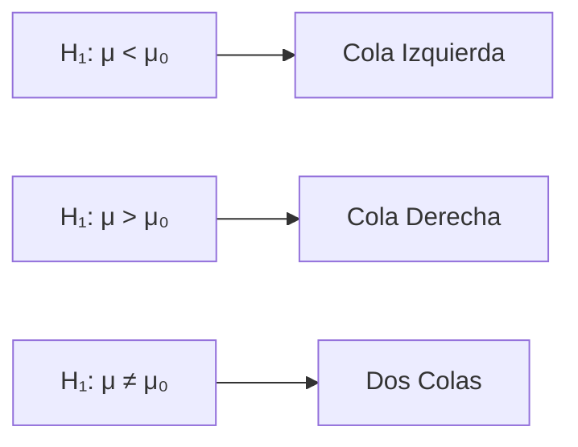

# Introducción

> **El Escenario:** Una fábrica afirma que sus bombillas duran 1000 horas en promedio. Un inspector sospecha que mienten. ¿Cómo lo prueba estadísticamente?

Las **Pruebas de Hipótesis** son el método formal para tomar decisiones basadas en datos. Es el corazón del método científico cuantitativo.

<Callout type="info">
**Analogía Legal:** Funciona como un juicio. El acusado (H₀) es "inocente hasta que se demuestre lo contrario". Solo lo condenamos si hay evidencia contundente.
</Callout>

## Objetivos de Aprendizaje
- Formular hipótesis nula (H₀) y alternativa (H₁).
- Entender los errores Tipo I (α) y Tipo II (β).
- Interpretar correctamente el p-valor.

---

# 1. Las Dos Hipótesis

| Hipótesis | Símbolo | Descripción |
|-----------|---------|-------------|
| **Nula** | H₀ | El "status quo". Lo que asumimos verdadero hasta tener evidencia. |
| **Alternativa** | H₁ o Hₐ | Lo que queremos probar. La "sospecha" del investigador. |

### Ejemplo: Bombillas
- **H₀:** μ = 1000 horas (la fábrica dice la verdad)
- **H₁:** μ < 1000 horas (las bombillas duran menos)

<Callout type="warning">
**Regla de Oro:** La hipótesis nula SIEMPRE contiene la igualdad (=, ≤, ≥).
</Callout>

---

# 2. Tipos de Prueba

| Tipo | H₁ | Región de Rechazo |
|------|----|--------------------|
| **Cola Izquierda** | μ < μ₀ | Valores muy pequeños |
| **Cola Derecha** | μ > μ₀ | Valores muy grandes |
| **Dos Colas** | μ ≠ μ₀ | Valores extremos en ambos lados |



---

# 3. Errores en la Decisión

| Decisión | H₀ es Verdadera | H₀ es Falsa |
|----------|-----------------|-------------|
| **No Rechazar H₀** | ✅ Correcto | ❌ Error Tipo II (β) |
| **Rechazar H₀** | ❌ Error Tipo I (α) | ✅ Correcto |

### Error Tipo I (α) - Falso Positivo
Condenar a un inocente. Rechazar H₀ cuando es verdadera.
**Controlamos esto:** Usualmente α = 0.05 (5%).

### Error Tipo II (β) - Falso Negativo
Dejar libre a un culpable. No rechazar H₀ cuando es falsa.
**Poder = 1 - β:** Probabilidad de detectar un efecto real.

<TypeIIError initialAlpha={0.05} initialEffectSize={0.5} />

<Callout type="note">
**¡Interactúa!** Ajusta α, el tamaño del efecto y n para ver el trade-off entre Error Tipo I, Tipo II y Poder estadístico.
</Callout>

---

# 4. El P-Valor: La Evidencia

El **p-valor** es la probabilidad de obtener un resultado tan extremo como el observado, **asumiendo que H₀ es verdadera**.

### Interpretación
- **p-valor pequeño (< α):** Evidencia fuerte contra H₀ → Rechazar H₀
- **p-valor grande (≥ α):** No hay suficiente evidencia → No rechazar H₀

<Callout type="warning">
**NO significa:** "Probabilidad de que H₀ sea verdadera". Eso sería Bayesiano.
</Callout>

<PValueExplainer initialZScore={1.96} testType="two-tailed" />

<Callout type="note">
**¡Interactúa!** Mueve el estadístico Z y observa cómo cambia el p-valor (área sombreada). Cambia el tipo de prueba para ver las diferencias entre una y dos colas.
</Callout>

---

# 5. El Procedimiento Paso a Paso

1. **Plantear** H₀ y H₁
2. **Elegir** nivel de significancia α (usualmente 0.05)
3. **Recolectar** datos y calcular el estadístico de prueba
4. **Calcular** el p-valor
5. **Decidir:** Si p-valor < α → Rechazar H₀

```python
# Ejemplo conceptual (lo aplicaremos en las siguientes lecciones)
alpha = 0.05
p_valor = 0.03  # Supongamos que calculamos esto

if p_valor < alpha:
    print(f"p-valor ({p_valor}) < α ({alpha})")
    print("Decisión: RECHAZAR H₀")
    print("Conclusión: Hay evidencia estadística contra la hipótesis nula.")
else:
    print(f"p-valor ({p_valor}) ≥ α ({alpha})")
    print("Decisión: NO RECHAZAR H₀")
    print("Conclusión: No hay suficiente evidencia para rechazar H₀.")
```

---

# Autoevaluación

<Quiz 
  title="Quiz: Fundamentos de Pruebas de Hipótesis"
  questions={[
    {
      id: "fh1",
      text: "La hipótesis nula (H₀) representa:",
      options: [
        { id: "a", text: "Lo que el investigador quiere probar", isCorrect: false, explanation: "Esa es H₁, la alternativa." },
        { id: "b", text: "El status quo o afirmación a refutar", isCorrect: true, explanation: "¡Correcto! H₀ es lo que asumimos verdadero inicialmente." },
        { id: "c", text: "El resultado esperado del experimento", isCorrect: false, explanation: "H₀ no es una predicción, es la hipótesis 'por defecto'." }
      ]
    },
    {
      id: "fh2",
      text: "Un Error Tipo I ocurre cuando:",
      options: [
        { id: "a", text: "Rechazamos H₀ siendo verdadera", isCorrect: true, explanation: "¡Exacto! Es un 'falso positivo'." },
        { id: "b", text: "No rechazamos H₀ siendo falsa", isCorrect: false, explanation: "Eso es Error Tipo II." },
        { id: "c", text: "Calculamos mal el estadístico", isCorrect: false, explanation: "Eso es un error de cálculo, no de decisión estadística." }
      ]
    },
    {
      id: "fh3",
      text: "Si el p-valor es 0.02 y α = 0.05, entonces:",
      options: [
        { id: "a", text: "No rechazamos H₀", isCorrect: false, explanation: "0.02 < 0.05, así que SÍ rechazamos." },
        { id: "b", text: "Rechazamos H₀", isCorrect: true, explanation: "¡Correcto! p-valor < α indica evidencia suficiente." },
        { id: "c", text: "Necesitamos más datos", isCorrect: false, explanation: "La decisión ya está clara con estos datos." }
      ]
    }
  ]}
/>
