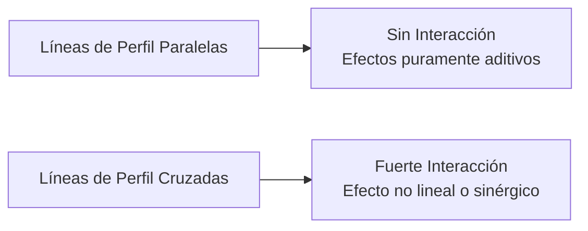

# Introducción

> En un proceso de mecanizado, aumentar la velocidad de corte puede mejorar el acabado superficial con la herramienta de carburo, pero destruirlo con la herramienta de acero rápido. Cuando el efecto de un factor depende del nivel de otro, estamos ante el fenómeno crucial de la **interacción**.

El **ANOVA de dos factores con replicación** permite evaluar simultáneamente dos variables independientes (Factor A y Factor B) y su término conjunto ($A \times B$).

<Callout type="info">
**Principio Jerárquico:** Si la interacción $A \times B$ resulta estadísticamente significativa ($p < 0.05$), los efectos principales individuales no deben interpretarse de forma aislada.
</Callout>

## Objetivos de Aprendizaje
- Escribir el modelo lineal: $Y_{ijk} = \mu + \alpha_i + \beta_j + (\alpha\beta)_{ij} + \epsilon_{ijk}$.
- Diagnosticar interacciones visuales mediante gráficos de perfiles (líneas cruzadas vs paralelas).
- Construir la tabla ANOVA bifactorial con Python (`statsmodels`).

---

# 1. El Modelo Matemático y Partición de Suma de Cuadrados

Para un diseño balanceado con $a$ niveles del Factor A, $b$ niveles del Factor B y $n$ réplicas por celda:

$$SCT = SC_A + SC_B + SC_{AB} + SCE$$

### Grados de Libertad:
- Factor A: $a - 1$
- Factor B: $b - 1$
- Interacción $AB$: $(a - 1)(b - 1)$
- Error Residual: $ab(n - 1)$
- Total: $abn - 1$

---

# 2. Diagnóstico Gráfico de Interacción



<Callout type="note">
**Regla Práctica:** Si al trazar las medias de las celdas las líneas entre niveles son paralelas, la interacción es nula. Si las líneas se cruzan o divergen fuertemente, existe interacción significativa.
</Callout>

---

# 3. Laboratorio en Python

```python
import pandas as pd
import statsmodels.api as sm
from statsmodels.formula.api import ols

# Experimento: Rendimiento químico según Temperatura y Presión
data = pd.DataFrame({
    'Temperatura': ['Baja', 'Baja', 'Baja', 'Baja', 'Alta', 'Alta', 'Alta', 'Alta'] * 2,
    'Presion': (['P1'] * 4 + ['P2'] * 4) * 2,
    'Rendimiento': [
        82, 84, 83, 85,  # Baja, P1
        91, 93, 90, 92,  # Alta, P1
        78, 79, 77, 80,  # Baja, P2
        96, 98, 95, 97   # Alta, P2
    ]
})

# Ajuste del modelo con término de interacción
modelo = ols('Rendimiento ~ C(Temperatura) + C(Presion) + C(Temperatura):C(Presion)', data=data).fit()
tabla_anova = sm.stats.anova_lm(modelo, typ=2)

print("Tabla ANOVA de Dos Factores:")
print(tabla_anova)
```

---

# Autoevaluación

<Quiz
  title="Quiz: ANOVA Bifactorial e Interacción"
  questions={[
    {
      id: "q_twoway_1",
      text: "Si la interacción entre dos factores A y B es estadísticamente significativa (p < 0.05), ¿cómo deben interpretarse los efectos principales?",
      options: [
        { id: "a", text: "No deben interpretarse aisladamente, sino evaluando el efecto de A condicionado a cada nivel de B", isCorrect: true, explanation: "Correcto: la interacción significa que el efecto de A depende del valor de B." },
        { id: "b", text: "Se pueden ignorar por completo y afirmar que el factor B no tiene ningún impacto", isCorrect: false, explanation: "Ambos factores impactan el sistema de manera conjunta." },
        { id: "c", text: "Se debe eliminar el factor A del análisis inmediatamente", isCorrect: false, explanation: "Al contrario, ambos factores deben conservarse en el modelo." }
      ]
    },
    {
      id: "q_twoway_2",
      text: "¿Cuántos grados de libertad tiene el término de interacción en un diseño con a=3 niveles de temperatura y b=4 niveles de catalizador?",
      options: [
        { id: "a", text: "(3 - 1) * (4 - 1) = 6", isCorrect: true, explanation: "Correcto: gl(AB) = (a - 1)(b - 1) = 2 * 3 = 6." },
        { id: "b", text: "3 * 4 = 12", isCorrect: false, explanation: "12 es el número total de celdas o combinaciones de tratamientos." },
        { id: "c", text: "3 + 4 - 1 = 6", isCorrect: false, explanation: "Aunque da 6 numéricamente, la fórmula correcta es el producto de los grados de libertad de cada factor." }
      ]
    }
  ]}
/>
