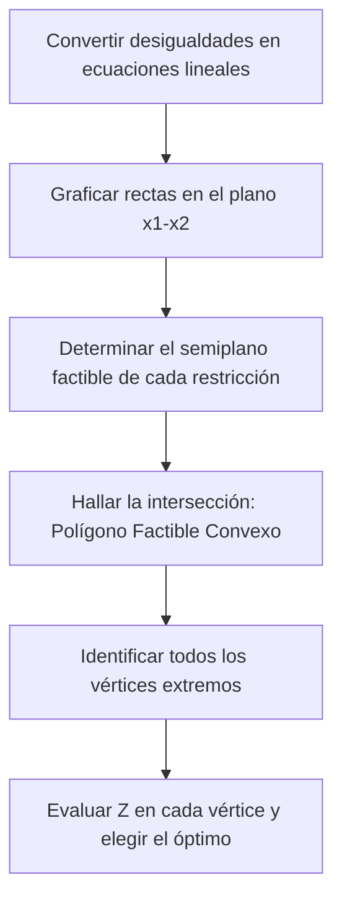

# Introducción

> ¿Por qué la solución óptima de un problema lineal se encuentra siempre en una esquina (vértice) de la región factible y nunca flotando en el interior? El método gráfico revela la hermosa geometría convexa subyacente a toda la optimización lineal.

El **Método Gráfico** aplica a modelos con dos variables de decisión ($x_1, x_2$). Permite trazar las líneas de frontera de cada restricción, identificar la **región factible** y desplazar la recta de nivel de la función objetivo hasta alcanzar el punto extremo óptimo.

<Callout type="info">
**Teorema Fundamental de la Programación Lineal:** Si un problema de programación lineal acotado posee una solución óptima única, esta ocurre necesariamente en al menos uno de los **vértices (puntos extremos)** del polítopo de soluciones factibles.
</Callout>

## Objetivos de Aprendizaje
- Trazar semiplanos en el plano cartesiano $x_1 - x_2$.
- Determinar las coordenadas de los vértices mediante la intersección de rectas activas.
- Evaluar la función objetivo en los vértices e identificar casos especiales (soluciones múltiples, no acotamiento, infactibilidad).

---

# 1. Pasos del Método Gráfico



---

# 2. Casos Especiales en Programación Lineal

1. **Solución Óptima Única:** Un solo vértice maximiza o minimiza $Z$.
2. **Soluciones Óptimas Múltiples:** La recta de la función objetivo es paralela a una restricción activa; todo el segmento entre dos vértices adyacentes es óptimo.
3. **Problema No Acotado (Unbounded):** La región factible es abierta hacia la dirección de mejora y $Z \to \infty$.
4. **Problema Infactible:** No existe ningún punto en el espacio que cumpla simultáneamente todas las restricciones.

---

# 3. Laboratorio Visual: Explorador Interactivo del Método Gráfico (UTP)

Explora a continuación el comportamiento de un modelo clásico de programación lineal en 2D. Desplaza el deslizador de ganancia $Z$ para observar cómo la recta de isoganancia avanza sobre la región factible y alcanza el vértice óptimo en el punto extremo $C(20, 60)$.

<LinearProgrammingVisualizer />

<Callout type="note">
**Análisis de Sensibilidad y Holguras:** Al hacer clic en cada vértice factible, revisa las variables de holgura ($s_1, s_2, s_3$). Las restricciones con holgura nula ($s_i = 0$) representan los cuellos de botella de la planta. Un aumento en la disponibilidad horaria de estos talleres desplazaría la frontera y aumentaría el valor óptimo de $Z^*$.
</Callout>

---

# 4. Código en Python para Trazar la Región Factible

```python
import numpy as np
import matplotlib.pyplot as plt

# Definición de rangos para x1
x1 = np.linspace(0, 50, 400)

# Restricciones:
# 2*x1 + x2 <= 80  --> x2 <= 80 - 2*x1
# 4*x1 + x2 <= 120 --> x2 <= 120 - 4*x1
y1 = 80 - 2 * x1
y2 = 120 - 4 * x1

# Frontera factible
y_factible = np.minimum(np.maximum(0, y1), np.maximum(0, y2))

# Vértices: (0,0), (0,80), (20,40), (30,0)
vertices = [(0, 0), (0, 80), (20, 40), (30, 0)]

print("Evaluación en vértices Z = 50*x1 + 30*x2:")
for v in vertices:
    z_val = 50 * v[0] + 30 * v[1]
    print(f"Vértice {v}: Z = ${z_val}")
```

---

# Autoevaluación

<Quiz
  title="Quiz: Método Gráfico"
  questions={[
    {
      id: "q_graph_1",
      text: "El Teorema Fundamental de la PL garantiza que la solución óptima:",
      options: [
        { id: "a", text: "Ocurre en al menos uno de los vértices (puntos extremos) de la región factible", isCorrect: true, explanation: "Correcto: la función lineal alcanza sus extremos en los vértices del poliedro convexo." },
        { id: "b", text: "Siempre se ubica exactamente en el centroide de la figura", isCorrect: false, explanation: "En el interior nunca se encuentra el óptimo en problemas lineales." },
        { id: "c", text: "Requiere que la región factible sea cóncava", isCorrect: false, explanation: "La región factible lineal siempre es convexa." }
      ]
    },
    {
      id: "q_graph_2",
      text: "Si dos restricciones se contradicen y no existe ningún punto común que las satisfaga simultáneamente, el problema es:",
      options: [
        { id: "a", text: "Infactible (sin solución)", isCorrect: true, explanation: "La región factible es el conjunto vacío." },
        { id: "b", text: "No acotado", isCorrect: false, explanation: "No acotado significa que la región es infinita en la dirección de optimización." },
        { id: "c", text: "Degenerado", isCorrect: false, explanation: "Degeneración ocurre cuando más de dos restricciones concurren en el mismo vértice." }
      ]
    }
  ]}
/>
