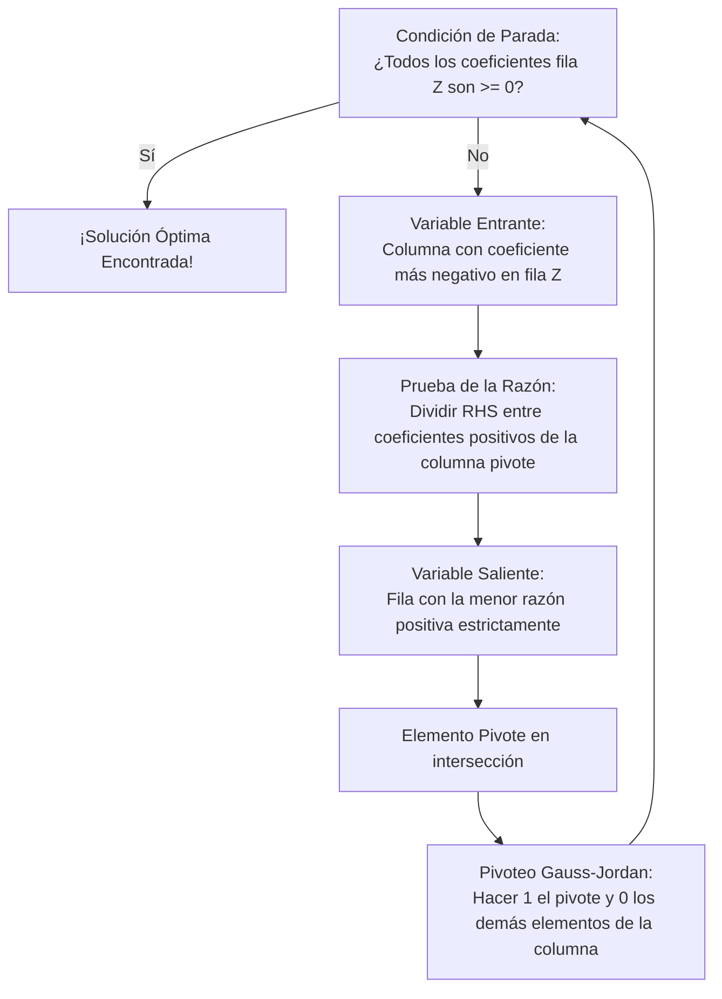

# Introducción

> El método gráfico nos mostró que el óptimo está en un vértice. En vez de evaluar a ciegas todos los vértices posibles ($\binom{n}{m}$ que en problemas reales pueden ser miles de millones), el **Algoritmo Simplex** camina inteligentemente a lo largo de las aristas del polítopo, pasando de un vértice a un vértice vecino adyacente **que siempre incremente (o mantenga) el valor de $Z$**.

Cuando ningún vértice vecino mejora la función objetivo, el algoritmo se detiene: ¡hemos alcanzado el óptimo global!

<Callout type="info">
**Estructura de la Tabla Simplex:**
| Base | $Z$ | $x_1$ | $\dots$ | $s_1$ | $\dots$ | Solución (RHS) |
| :---: | :---: | :---: | :---: | :---: | :---: | :---: |
| $Z$ | $1$ | $-(c_1 - z_1)$ | $\dots$ | $0$ | $\dots$ | $Z_{actual}$ |
| $x_{B_1}$ | $0$ | $a_{11}'$ | $\dots$ | $1$ | $\dots$ | $b_1'$ |
</Callout>

## Objetivos de Aprendizaje
- Identificar la **Variable Entrante** usando el costo reducido más negativo (maximización).
- Determinar la **Variable Saliente** usando la prueba de la razón mínima: $\theta = \min \{b_i / a_{ik} \mid a_{ik} > 0\}$.
- Ejecutar el pivoteo de Gauss-Jordan para actualizar la base.

---

# 1. Pasos de la Iteración Simplex



---

# 2. Casos de Detección en la Tabla

- **Solución No Acotada:** Si en la columna de la variable entrante todos los coeficientes son $\le 0$, no se puede calcular ninguna razón positiva: la variable entrante puede crecer indefinidamente y $Z \to \infty$.
- **Solución Óptima Múltiple:** En la tabla óptima final, una variable no básica tiene un coeficiente de $0$ en la fila $Z$. Al forzarla a entrar a la base, se obtiene otro vértice óptimo con el mismo valor de $Z$.
- **Degeneración / Ciclado:** La razón mínima es 0 (un $b_i = 0$ en la base), por lo que $Z$ no aumenta en esa iteración.

---

# 3. Código en Python con `scipy.optimize`

```python
from scipy.optimize import linprog

# Maximizar Z = 3*x1 + 5*x2
# Equivalente a minimizar -3*x1 - 5*x2
c = [-3, -5]

A = [
    [1, 0],   # x1 <= 4
    [0, 2],   # 2*x2 <= 12
    [3, 2]    # 3*x1 + 2*x2 <= 18
]
b = [4, 12, 18]

res = linprog(c, A_ub=A, b_ub=b, method='simplex')

print("Éxito:", res.success)
print(f"Solución: x1 = {res.x[0]}, x2 = {res.x[1]}")
print(f"Valor óptimo de Z = {-res.fun}")
print(f"Número de iteraciones simplex: {res.nit}")
```

---

# Autoevaluación

<Quiz
  title="Quiz: Algoritmo Simplex Tabular"
  questions={[
    {
      id: "q_spx_1",
      text: "En un problema de maximización, ¿cómo se selecciona la variable que entra a la base?",
      options: [
        { id: "a", text: "La que tiene el coeficiente más negativo en la fila Z (mayor tasa de mejora por unidad)", isCorrect: true, explanation: "Correcto: según la regla de Dantzig, el coeficiente más negativo en la fila Z - c_j indica la variable que más aporta al objetivo." },
        { id: "b", text: "La que tiene el valor más grande en el lado derecho (RHS)", isCorrect: false, explanation: "El RHS no determina la entrada sino la cantidad factible disponible." },
        { id: "c", text: "Siempre la variable de holgura de la primera restricción", isCorrect: false, explanation: "Las variables de holgura ya suelen estar en la base inicial." }
      ]
    },
    {
      id: "q_spx_2",
      text: "¿Por qué en la prueba de la razón mínima para la variable saliente se descartan denominadores menores o iguales a cero (a_ik <= 0)?",
      options: [
        { id: "a", text: "Porque un a_ik <= 0 indica que aumentar esa variable no consume el recurso i y no restringe su crecimiento", isCorrect: true, explanation: "Correcto: solo los coeficientes positivos representan restricciones que se agotan al aumentar la variable entrante." },
        { id: "b", text: "Porque la división por cero no existe en cálculo numérico", isCorrect: false, explanation: "Además de la imposibilidad algebraica, geométricamente no impone un límite superior de factibilidad." },
        { id: "c", text: "Porque el método simplex solo acepta números primos", isCorrect: false, explanation: "El método simplex opera sobre cualquier número real." }
      ]
    }
  ]}
/>
