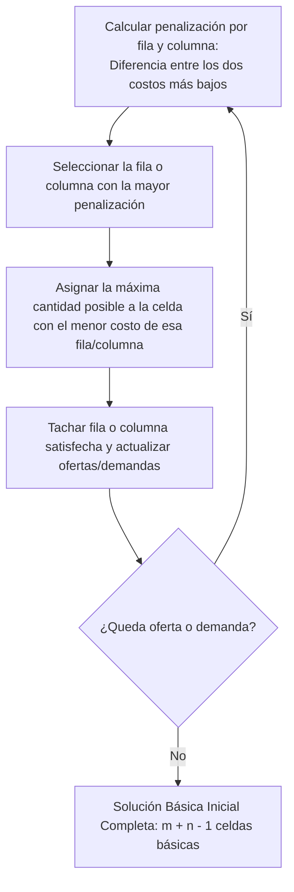

# Introducción

> En la cadena de suministro de una empresa de alimentos, múltiples plantas de producción deben abastecer a una red de centros de distribución en diferentes ciudades con costos de flete variables. ¿Cómo satisfacer la demanda de todos los clientes al mínimo costo total de transporte?

El **Problema del Transporte** es un caso especial de programación lineal con una estructura en red puramente bipartita que permite métodos de resolución mucho más veloces que el Simplex general.

<Callout type="info">
**Propiedad de Unimodularidad Total:** Si las ofertas $a_i$ y las demandas $b_j$ son valores enteros, la solución óptima del problema de transporte **siempre estará compuesta por números enteros**, sin necesidad de imponer programación entera.
</Callout>

## Objetivos de Aprendizaje
- Formular el modelo de transporte y balancear oferta vs demanda agregando plantas o destinos ficticios.
- Generar una solución básica factible inicial de alta calidad mediante el Método de Aproximación de Vogel (VAM).
- Verificar y optimizar mediante el método de los potenciales o multiplicadores (MODI).

---

# 1. Formulación del Modelo

Sean $m$ orígenes con oferta $a_i$ y $n$ destinos con demanda $b_j$:

$$\text{Min } Z = \sum_{i=1}^m \sum_{j=1}^n c_{ij} x_{ij}$$

Sujeto a:
$$\sum_{j=1}^n x_{ij} = a_i \quad \text{para todo } i=1, \dots, m \quad (\text{Oferta})$$
$$\sum_{i=1}^m x_{ij} = b_j \quad \text{para todo } j=1, \dots, n \quad (\text{Demanda})$$
$$x_{ij} \ge 0$$

Condición de Balance: $\sum_{i=1}^m a_i = \sum_{j=1}^n b_j$. Si $\sum a_i \ne \sum b_j$, se añade un origen o destino ficticio con costo de transporte $c = 0$.

---

# 2. El Método de Aproximación de Vogel (VAM)

El VAM utiliza las **penalizaciones** (costo de oportunidad por no elegir la ruta más económica):



---

# 3. Código en Python con `scipy.optimize`

```python
import numpy as np
from scipy.optimize import linprog

# 2 Plantas (Oferta: [30, 40])
# 3 Bodegas (Demanda: [20, 25, 25])
ofertas = [30, 40]
demandas = [20, 25, 25]

# Matriz de costos de transporte C [2 x 3]
costos = np.array([
    [6, 8, 10],   # De Planta 1 a Bodegas 1, 2, 3
    [7, 11, 11]   # De Planta 2 a Bodegas 1, 2, 3
]).flatten()

# Restricciones de igualdad para oferta y demanda
A_eq = [
    [1, 1, 1, 0, 0, 0],  # Planta 1
    [0, 0, 0, 1, 1, 1],  # Planta 2
    [1, 0, 0, 1, 0, 0],  # Bodega 1
    [0, 1, 0, 0, 1, 0],  # Bodega 2
    [0, 0, 1, 0, 0, 1]   # Bodega 3
]
b_eq = [30, 40, 20, 25, 25]

res = linprog(costos, A_eq=A_eq, b_eq=b_eq, bounds=(0, None), method='highs')

asignacion = res.x.reshape((2, 3))
print("Matriz Óptima de Asignación (unidades transportadas):")
print(asignacion)
print(f"Costo Mínimo Total de Transporte: ${res.fun:.2f}")
```

---

# Autoevaluación

<Quiz
  title="Quiz: Problema del Transporte"
  questions={[
    {
      id: "q_trans_1",
      text: "¿Cuántas celdas básicas debe tener una solución básica factible no degenerada en una tabla de transporte con m orígenes y n destinos?",
      options: [
        { id: "a", text: "m + n - 1 celdas", isCorrect: true, explanation: "Correcto: debido a la redundancia de una de las ecuaciones de balance, los grados de libertad básicos son m + n - 1." },
        { id: "b", text: "m * n celdas", isCorrect: false, explanation: "m * n es el número total de celdas en la matriz de transporte." },
        { id: "c", text: "m + n celdas", isCorrect: false, explanation: "Siempre es una menos debido a la dependencia lineal de la suma total." }
      ]
    },
    {
      id: "q_trans_2",
      text: "¿Para qué sirve calcular la penalización en el Método de Aproximación de Vogel (VAM)?",
      options: [
        { id: "a", text: "Mide el costo adicional en el que se incurre si no se asigna a la celda más barata de esa fila o columna", isCorrect: true, explanation: "VAM es un método heurístico voraz inteligente: ataca primero las filas/columnas donde equivocarse cuesta más." },
        { id: "b", text: "Sirve para descartar las demandas insatisfechas", isCorrect: false, explanation: "Todas las demandas deben ser satisfechas en el modelo balanceado." },
        { id: "c", text: "Indica el número de camiones requeridos", isCorrect: false, explanation: "Es una métrica puramente monetaria de costo de oportunidad." }
      ]
    }
  ]}
/>
