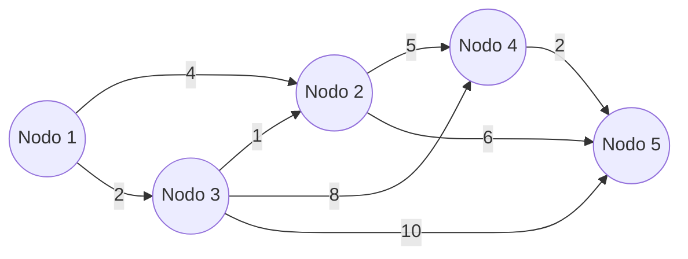

# Introducción

> ¿Cómo calcula Google Maps la ruta más rápida entre dos direcciones en milisegundos? ¿Cómo diseña una empresa de telecomunicaciones el tendido de fibra óptica para conectar 10 ciudades gastando la menor cantidad posible de cable?

La **Optimización de Redes** modela sistemas complejos mediante grafos compuestos por **nodos** (ciudades, enrutadores, servidores) y **arcos** o aristas (carreteras, cables, tuberías) con capacidades y costos asociados.

<Callout type="info">
**Diferencia Conceptual Clave:**
- **Ruta Más Corta (Dijkstra):** Busca conectar un nodo origen con un nodo destino recorriendo la distancia total mínima.
- **Árbol de Expansión Mínima (MST):** Busca interconectar **todos los nodos** de la red sin formar ciclos con la longitud total mínima de arcos.
</Callout>

## Objetivos de Aprendizaje
- Representar redes mediante matrices de adyacencia y grafos dirigidos / no dirigidos.
- Aplicar paso a paso el Algoritmo de Dijkstra con etiquetas permanentes y tentativas.
- Aplicar el Algoritmo de Kruskal seleccionando arcos de menor peso sin generar ciclos.

---

# 1. El Algoritmo de Dijkstra

Dado un grafo con pesos no negativos $c_{ij} \ge 0$:



1. Asignar al nodo origen distancia 0 (etiqueta permanente $[0, -]$) y a todos los demás distancia $\infty$ (tentativa).
2. Desde el nodo recién fijado, actualizar las distancias tentativas de todos sus vecinos:
   $$d(j) = \min(d(j), d(i) + c_{ij})$$
3. Seleccionar el nodo con la menor distancia tentativa y marcarlo como **permanente**.
4. Repetir hasta que el nodo destino quede marcado como permanente.

---

# 2. Código en Python con `scipy.sparse.csgraph`

```python
import numpy as np
from scipy.sparse.csgraph import dijkstra, minimum_spanning_tree

# Matriz de adyacencia con pesos (0 indica sin conexión directa)
# Nodos: 0, 1, 2, 3, 4
grafo = np.array([
    [0, 4, 2, 0, 0],
    [0, 0, 0, 5, 6],
    [0, 1, 0, 8, 10],
    [0, 0, 0, 0, 2],
    [0, 0, 0, 0, 0]
])

# 1. Ruta más corta desde el nodo 0 con Dijkstra
distancias, predecesores = dijkstra(csgraph=grafo, indices=0, return_predecessors=True)
print("Distancias mínimas desde el nodo 0 a cada nodo:")
for i, d in enumerate(distancias):
    print(f"Nodo {i}: distancia = {d}")

# 2. Árbol de Expansión Mínima (grafo no dirigido simétrico)
grafo_simetrico = grafo + grafo.T
mst = minimum_spanning_tree(grafo_simetrico)
print(f"\nPeso Total del Árbol de Expansión Mínima: {mst.toarray().sum() / 2:.2f}")
```

---

# Autoevaluación

<Quiz
  title="Quiz: Ruta Más Corta y Árbol de Expansión Mínima"
  questions={[
    {
      id: "q_net_1",
      text: "¿Por qué el Algoritmo de Dijkstra tradicional requiere que los pesos de los arcos sean estrictamente no negativos (c_ij >= 0)?",
      options: [
        { id: "a", text: "Porque una arista negativa puede generar ciclos negativos donde la distancia decrece al infinito y la etiqueta permanente deja de ser definitiva", isCorrect: true, explanation: "Correcto: con aristas negativas se debe emplear el algoritmo de Bellman-Ford." },
        { id: "b", text: "Porque la memoria del computador no almacena signos negativos", isCorrect: false, explanation: "Es un principio de convergencia y optimalidad del algoritmo, no una limitación de hardware." },
        { id: "c", text: "Porque solo se aplica a redes de agua potable", isCorrect: false, explanation: "Dijkstra es un algoritmo universal sobre cualquier grafo ponderado." }
      ]
    },
    {
      id: "q_net_2",
      text: "En un grafo conexo con N nodos, ¿cuántos arcos tiene exactamente cualquier Árbol de Expansión Mínima (MST)?",
      options: [
        { id: "a", text: "N - 1 arcos", isCorrect: true, explanation: "Correcto: un árbol de N nodos siempre tiene exactamente N - 1 arcos para interconectar todos los vértices sin crear ciclos." },
        { id: "b", text: "N arcos", isCorrect: false, explanation: "N arcos en un grafo conexo forzosamente crearía al menos un ciclo." },
        { id: "c", text: "N * (N - 1) / 2 arcos", isCorrect: false, explanation: "Ese es el número máximo de aristas de un grafo completo." }
      ]
    }
  ]}
/>
