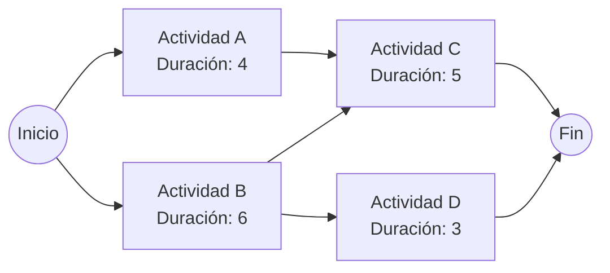

# Introducción

> La construcción de una planta hidroeléctrica, el lanzamiento de un satélite o el desarrollo de un nuevo vehículo involucran miles de actividades interdependientes. Retrasar una sola actividad puede postergar la entrega meses y acarrear millones en penalizaciones.

Las técnicas **CPM (Critical Path Method)** y **PERT (Program Evaluation and Review Technique)** modelan el proyecto como una red dirigida donde las aristas representan actividades y los nodos representan hitos temporales.

<Callout type="info">
**La Ruta Crítica:** Es la secuencia continua de actividades desde el inicio hasta el final del proyecto que tiene **holgura total cero ($H_t = 0$)**. Cualquier retraso en una actividad crítica retrasará la fecha final de culminación de todo el proyecto en la misma proporción.
</Callout>

## Objetivos de Aprendizaje
- Construir diagramas de precedencia AON (Activity on Node).
- Calcular los Tiempos Más Tempranos ($ES, EF$) mediante el recorrido hacia adelante (*Forward Pass*).
- Calcular los Tiempos Más Tardíos ($LS, LF$) mediante el recorrido hacia atrás (*Backward Pass*).
- Identificar la holgura total ($HT = LS - ES = LF - EF$) y trazar la Ruta Crítica.

---

# 1. Algoritmo de Recorrido Temporal



### 1. Pase Hacia Adelante (Tiempos Tempranos)
$$EF_i = ES_i + D_i$$
$$ES_j = \max_{\{i \in Predecesores\}} (EF_i)$$

### 2. Pase Hacia Atrás (Tiempos Tardíos)
$$LS_i = LF_i - D_i$$
$$LF_i = \min_{\{j \in Sucesores\}} (LS_j)$$

### 3. Holgura Total ($HT$)
$$HT_i = LS_i - ES_i = LF_i - EF_i$$
Una actividad es **crítica** si y solo si $HT_i = 0$.

---

# 2. Análisis Probabilístico con PERT

Cuando las duraciones son inciertas, PERT utiliza una distribución Beta basada en tres estimaciones de tiempo:
- $a$: Tiempo optimista
- $m$: Tiempo más probable
- $b$: Tiempo pesimista

$$Tiempo\ Esperado: \quad \mu = \frac{a + 4m + b}{6}$$
$$Varianza: \quad \sigma^2 = \left( \frac{b - a}{6} \right)^2$$

---

# 3. Código en Python para Cálculo de Ruta Crítica

```python
import pandas as pd
import numpy as np

# Definición de actividades del proyecto
actividades = pd.DataFrame([
    {'id': 'A', 'dur': 4, 'pred': []},
    {'id': 'B', 'dur': 6, 'pred': []},
    {'id': 'C', 'dur': 5, 'pred': ['A', 'B']},
    {'id': 'D', 'dur': 3, 'pred': ['B']}
])

# Forward Pass (Tiempos tempranos)
ES = {}
EF = {}
for _, row in actividades.iterrows():
    act_id = row['id']
    preds = row['pred']
    dur = row['dur']
    es_val = max([EF[p] for p in preds], default=0)
    ES[act_id] = es_val
    EF[act_id] = es_val + dur

duracion_proyecto = max(EF.values())
print(f"Duración Total del Proyecto: {duracion_proyecto} semanas")

# Backward Pass (Tiempos tardíos)
LF = {}
LS = {}
for _, row in actividades.iloc[::-1].iterrows():
    act_id = row['id']
    dur = row['dur']
    # Sucesores
    sucesores = actividades[actividades['pred'].apply(lambda x: act_id in x)]['id'].tolist()
    lf_val = min([LS[s] for s in sucesores], default=duracion_proyecto)
    LF[act_id] = lf_val
    LS[act_id] = lf_val - dur

# Holgura y Ruta Crítica
actividades['ES'] = [ES[i] for i in actividades['id']]
actividades['EF'] = [EF[i] for i in actividades['id']]
actividades['LS'] = [LS[i] for i in actividades['id']]
actividades['LF'] = [LF[i] for i in actividades['id']]
actividades['Holgura'] = actividades['LS'] - actividades['ES']
actividades['Critica'] = actividades['Holgura'] == 0

print("\nTabla de Control del Proyecto:")
print(actividades[['id', 'dur', 'ES', 'EF', 'LS', 'LF', 'Holgura', 'Critica']])
```

---

# Autoevaluación

<Quiz
  title="Quiz: Gestión de Proyectos con PERT/CPM"
  questions={[
    {
      id: "q_pert_1",
      text: "Una actividad en una red de proyectos tiene una holgura total de 4 días. ¿Qué significa esto para el director del proyecto?",
      options: [
        { id: "a", text: "Esa actividad puede retrasarse hasta 4 días sin posponer la fecha de finalización global del proyecto", isCorrect: true, explanation: "Correcto: la holgura total es el margen de retraso disponible sin impactar la entrega final." },
        { id: "b", text: "La actividad debe iniciarse exactamente 4 días antes del comienzo del proyecto", isCorrect: false, explanation: "No se puede iniciar antes de la fecha cero del proyecto." },
        { id: "c", text: "Es una actividad de la ruta crítica", isCorrect: false, explanation: "Las actividades de la ruta crítica tienen holgura total estrictamente igual a cero." }
      ]
    },
    {
      id: "q_pert_2",
      text: "En el método PERT, la fórmula del tiempo esperado t_e = (a + 4m + b) / 6 asigna un peso de 4 al tiempo más probable (m) porque se asume una distribución:",
      options: [
        { id: "a", text: "Distribución Beta unimodal", isCorrect: true, explanation: "Correcto: PERT modela las duraciones de tareas mediante una aproximación a la distribución Beta." },
        { id: "b", text: "Distribución Uniforme", isCorrect: false, explanation: "La distribución uniforme asignaría igual peso a todos los valores posibles." },
        { id: "c", text: "Distribución Exponencial pura", isCorrect: false, explanation: "La distribución exponencial no tiene tiempo pesimista finito ni cota superior." }
      ]
    }
  ]}
/>
