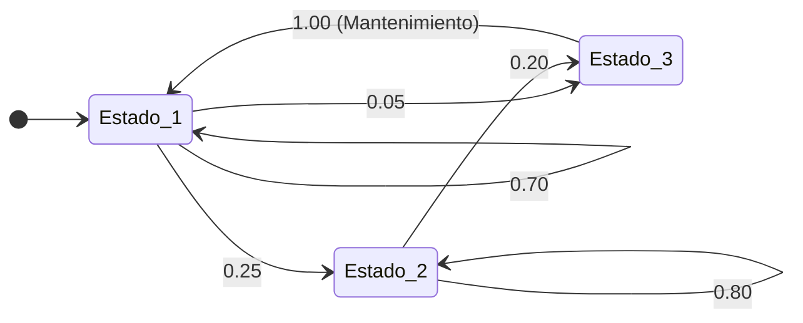

# Introducción

En los sistemas industriales reales, las variables no evolucionan de forma determinística: el desgaste de una máquina, la lealtad de un cliente o el nivel de inventario fluctúan con incertidumbre a lo largo del tiempo. Un **proceso estocástico** es una familia de variables aleatorias $\{X_t, t \in T\}$ indexadas en el tiempo.

Cuando el estado futuro de un sistema depende **únicamente de su estado actual** y no de toda la trayectoria histórica previa, decimos que el proceso tiene la **propiedad de Markov** (propiedad sin memoria):

$$ P(X_{n+1} = j \mid X_n = i, X_{n-1} = i_{n-1}, \dots, X_0 = i_0) = P(X_{n+1} = j \mid X_n = i) = P_{ij} $$

<Callout type="info">
**Propiedad de Markov (Sin Memoria):**
Dado el presente, el futuro es condicionalmente independiente del pasado. Toda la información histórica relevante para pronosticar el siguiente estado está contenida en el estado actual.
</Callout>

## Objetivos de Aprendizaje
- Comprender la definición formal de proceso estocástico y la propiedad markoviana.
- Construir matrices estocásticas de transición de un solo paso y diagramas de estados.
- Aplicar las ecuaciones de Chapman-Kolmogorov para proyectar estados a $n$ periodos mediante potencias de matrices ($P^n$).

---

# 1. Matriz de Transición de Probabilidades

Sea un espacio de estados finito $S = \{1, 2, \dots, M\}$. La probabilidad de pasar del estado $i$ al estado $j$ en un solo periodo de tiempo es $P_{ij}$.

La **Matriz de Transición de un Paso** $P$ cumple dos propiedades fundamentales:
1. $P_{ij} \ge 0 \quad \forall i, j$ (todas las probabilidades son no negativas).
2. $\sum_{j=1}^M P_{ij} = 1 \quad \forall i$ (la suma de probabilidades de cada fila es igual a 1).

$$
P = \begin{pmatrix}
P_{11} & P_{12} & \cdots & P_{1M} \\
P_{21} & P_{22} & \cdots & P_{2M} \\
\vdots & \vdots & \ddots & \vdots \\
P_{M1} & P_{M2} & \cdots & P_{MM}
\end{pmatrix}
$$

---

# 2. Caso Industrial: Monitoreo de Desgaste de Maquinaria CNC

Una máquina fresadora CNC de alta precisión es inspeccionada al final de cada turno productivo de 8 horas. Su estado de desgaste se clasifica en 3 niveles:
- **Estado 1 (Óptimo):** Tolerancias dimensionales perfectas.
- **Estado 2 (Desgaste Menor):** Requiere calibración, pero sigue operando.
- **Estado 3 (Falla Crítica):** Paro de línea por rotura de herramienta o fuera de tolerancia.

Los datos históricos del departamento de mantenimiento definen la siguiente matriz de transición de un turno al siguiente:

$$
P = \begin{pmatrix}
0.70 & 0.25 & 0.05 \\
0.00 & 0.80 & 0.20 \\
1.00 & 0.00 & 0.00
\end{pmatrix}
$$

> Nota: En el Estado 3, la cuadrilla de mantenimiento sustituye la herramienta de inmediato durante el cambio de turno, devolviendo la máquina al Estado 1 con probabilidad 1.0.



---

# 3. Ecuaciones de Chapman-Kolmogorov

¿Cuál es la probabilidad de que una máquina en estado óptimo hoy termine en falla dentro de 3 turnos?

Las **Ecuaciones de Chapman-Kolmogorov** demuestran que la matriz de probabilidades de transición en $n$ pasos, denotada $P^{(n)}$, se obtiene simplemente elevando la matriz de un paso a la potencia $n$:

$$ P^{(n)} = P^n = \underbrace{P \times P \times \dots \times P}_{n \text{ veces}} $$

Si el vector de probabilidad inicial es $\pi^{(0)} = [\pi_1^{(0)}, \pi_2^{(0)}, \dots, \pi_M^{(0)}]$, la distribución de probabilidad tras $n$ turnos es:

$$ \pi^{(n)} = \pi^{(0)} \cdot P^n $$

---

# 4. Implementación en Python

Simulamos las transiciones de la máquina CNC a 1, 3 y 10 turnos utilizando álgebra matricial con `numpy`:

```python
import numpy as np

# 1. Definición de la matriz de transición
P = np.array([
    [0.70, 0.25, 0.05],  # Desde Óptimo
    [0.00, 0.80, 0.20],  # Desde Desgaste
    [1.00, 0.00, 0.00]   # Desde Falla (reparación)
])

# Verificación de matriz estocástica (suma de filas = 1)
assert np.allclose(P.sum(axis=1), 1.0), "Cada fila debe sumar exactamente 1.0"

# 2. Matriz de transición a 3 turnos (P^3)
P_3 = np.linalg.matrix_power(P, 3)

# 3. Matriz de transición a 10 turnos (P^10)
P_10 = np.linalg.matrix_power(P, 10)

# Estado inicial: Máquina arranca completamente nueva (Estado 1)
pi_0 = np.array([1.0, 0.0, 0.0])

pi_3 = pi_0 @ P_3
pi_10 = pi_0 @ P_10

print("--- Matriz P^3 (Transición a 3 turnos) ---")
print(np.round(P_3, 4))
print(f"\nProbabilidades tras 3 turnos: Óptimo={pi_3[0]:.3f}, Desgaste={pi_3[1]:.3f}, Falla={pi_3[2]:.3f}")

print("\n--- Matriz P^10 (Transición a 10 turnos) ---")
print(np.round(P_10, 4))
print(f"Probabilidades tras 10 turnos: Óptimo={pi_10[0]:.3f}, Desgaste={pi_10[1]:.3f}, Falla={pi_10[2]:.3f}")
```

<Callout type="warning">
Observa cómo en $P^{10}$ las filas comienzan a converger hacia valores muy similares. Este fenómeno anticipa el concepto de **estado estacionario** que exploraremos en la siguiente sesión.
</Callout>

---

# Autoevaluación

<Quiz
  title="Quiz: Cadenas de Markov y Matrices de Transición"
  questions={[
    {
      id: "q_markov_1",
      text: "¿Cuál es la característica definitoria fundamental de un proceso de Markov en tiempo discreto?",
      options: [
        { id: "a", text: "La probabilidad de transición al estado siguiente depende exclusivamente del estado presente y es independiente de la historia de estados anteriores", isCorrect: true, explanation: "Correcto: Es la propiedad de pérdida de memoria o 'sin memoria' (Markov property)." },
        { id: "b", text: "Que todos los estados tienen exactamente la misma probabilidad de ocurrencia en cada paso", isCorrect: false, explanation: "Las probabilidades pueden ser completamente asimétricas y heterogéneas." },
        { id: "c", text: "Que la suma de cada columna en la matriz de transición debe ser exactamente 1.0", isCorrect: false, explanation: "Es la suma de cada FILA la que debe ser 1.0 (suma de probabilidades de salida desde un estado origen)." }
      ]
    },
    {
      id: "q_markov_2",
      text: "Si la matriz de transición de un paso es P, ¿cómo se calcula analíticamente la probabilidad de pasar del estado i al estado j en exactamente n pasos según el teorema de Chapman-Kolmogorov?",
      options: [
        { id: "a", text: "Tomando el elemento en la fila i y columna j de la matriz resultante de elevar P a la potencia n (Pⁿ)", isCorrect: true, explanation: "Correcto: Chapman-Kolmogorov establece que P^(n) = P^n mediante multiplicación matricial sucesiva." },
        { id: "b", text: "Multiplicando la matriz P por el escalar n", isCorrect: false, explanation: "Multiplicar por un escalar n violaría la suma estocástica de filas y no representa probabilidad condicional compuesta." },
        { id: "c", text: "Calculando la transpuesta de P dividida entre n", isCorrect: false, explanation: "La transpuesta no tiene relación con el avance temporal del proceso estocástico." }
      ]
    },
    {
      id: "q_markov_3",
      text: "En la matriz de una máquina con P = [[0.7, 0.25, 0.05], [0, 0.8, 0.2], [1, 0, 0]], si la máquina se encuentra actualmente en Estado 2 (Desgaste), ¿cuál es la probabilidad de que continúe en Estado 2 tras dos turnos consecutivos (P₂₂²)?",
      options: [
        { id: "a", text: "0.64 (calculado como 0.0 × 0.25 + 0.8 × 0.8 + 0.2 × 0 = 0.64)", isCorrect: true, explanation: "Correcto: La entrada (2,2) de P² es la fila 2 multiplicada por la columna 2: 0(0.25) + 0.8(0.8) + 0.2(0) = 0.64." },
        { id: "b", text: "0.80, porque no cambia en un turno", isCorrect: false, explanation: "0.80 es la probabilidad en 1 solo turno; en 2 turnos existe el riesgo de pasar a falla en el intermedio." },
        { id: "c", text: "1.60", isCorrect: false, explanation: "Una probabilidad nunca puede ser mayor a 1.0." }
      ]
    }
  ]}
/>
