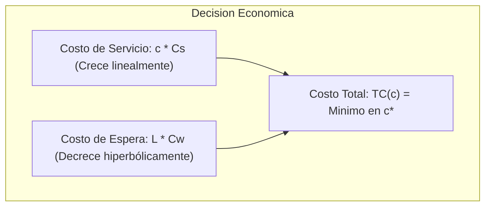

# Introducción

Cuando un solo servidor resulta insuficiente o genera esperas inaceptables, los ingenieros de operaciones recurren a sistemas multicanal: múltiples servidores trabajando en paralelo alimentados por una **única cola compartida** (como en aeropuertos, bancos o muelles de carga).

Una fila única con múltiples servidores es matemáticamente mucho más eficiente que tener filas separadas para cada servidor, pues evita que un servidor quede desocupado mientras en otra ventanilla hay clientes atascados.

<Callout type="info">
**Ventaja de la Cola Única Compartida:**
Agrupar la capacidad en un sistema $M/M/c$ con una sola fila compartida minimiza la probabilidad de servidores ociosos mientras haya clientes esperando, reduciendo la varianza del tiempo de espera global.
</Callout>

## Objetivos de Aprendizaje
- Calcular las probabilidades de estado y métricas operativas de un sistema $M/M/c$.
- Interpretar la fórmula de Erlang C para la probabilidad de demora.
- Construir modelos de optimización de costos totales para determinar el número óptimo de servidores ($c^*$).

---

# 1. El Modelo Multicanal $M/M/c$

Supuestos:
- Llegadas Poisson con tasa $\lambda$.
- Tiempos de servicio exponenciales con tasa $\mu$ por cada servidor.
- $c$ servidores idénticos operando en paralelo.
- Capacidad máxima total de servicio: $c \cdot \mu$.

### Utilización del Sistema Multicanal ($\rho$):
$$ \rho = \frac{\lambda}{c \mu} $$

Para estabilidad, se requiere estrictamente que:
$$ \rho < 1 \quad \iff \quad \lambda < c \mu $$

### Probabilidad de Sistema Vacío ($P_0$):
$$ P_0 = \left[ \sum_{n=0}^{c-1} \frac{1}{n!} \left(\frac{\lambda}{\mu}\right)^n + \frac{1}{c!} \left(\frac{\lambda}{\mu}\right)^c \left(\frac{1}{1 - \rho}\right) \right]^{-1} $$

### Métricas de Rendimiento del $M/M/c$:
- **Longitud media en la cola ($L_q$):**
  $$ L_q = \frac{P_0 \left(\frac{\lambda}{\mu}\right)^c \rho}{c! (1 - \rho)^2} $$
- **Tiempo medio de espera en cola ($W_q$):**
  $$ W_q = \frac{L_q}{\lambda} $$
- **Tiempo medio en el sistema total ($W$):**
  $$ W = W_q + \frac{1}{\mu} $$
- **Número medio de clientes en el sistema ($L$):**
  $$ L = L_q + \frac{\lambda}{\mu} $$

---

# 2. Modelo Económico: Determinación del Número Óptimo de Servidores ($c^*$)

El dimensionamiento de capacidad implica dos fuerzas contrapuestas:
1. **Costo de Servicio ($C_s$):** Salarios, amortización de maquinaria, licencias de software por cada servidor activo (\$/hora-servidor).
2. **Costo de Espera ($C_w$):** Descontento de clientes, penalizaciones por retraso, costo de capital inmovilizado en WIP (\$/hora-cliente en espera).

El **Costo Total Esperado por Unidad de Tiempo** $TC(c)$ es:

$$ TC(c) = c \cdot C_s + L \cdot C_w \quad \text{o alternativamente} \quad TC(c) = c \cdot C_s + L_q \cdot C_w $$



---

# 3. Caso Industrial: Centro de Carga y Descarga de Camiones

Un centro de distribución logística recibe camiones a una tasa de $\lambda = 15$ camiones por hora. Cada bahía de descarga puede procesar en promedio $\mu = 6$ camiones por hora.
- Salario del equipo de operadores por bahía: $C_s = \$40$/hora.
- Costo de inactividad de un camión con flete: $C_w = \$120$/hora.

> Condición mínima de estabilidad: $c > \frac{\lambda}{\mu} = \frac{15}{6} = 2.5 \implies$ Se requieren al menos $c \ge 3$ bahías para evitar colas infinitas.

¿Cuál es el número óptimo de bahías a habilitar: 3, 4, 5 o 6?

---

# 4. Implementación en Python: Optimizador de Servidores

```python
import math
import numpy as np

def mmc_analysis(lambd, mu, c, Cs, Cw):
    """Calcula métricas operativas y costos de un sistema M/M/c."""
    rho = lambd / (c * mu)
    if rho >= 1.0:
        return {"c": c, "rho": rho, "feasible": False}
    
    a = lambd / mu  # Carga de tráfico (Erlangs)
    
    # 1. Cálculo de P0
    sum_terms = sum((a ** n) / math.factorial(n) for n in range(c))
    last_term = ((a ** c) / (math.factorial(c) * (1 - rho)))
    P0 = 1.0 / (sum_terms + last_term)
    
    # 2. Longitud en cola Lq
    Lq = (P0 * (a ** c) * rho) / (math.factorial(c) * ((1 - rho) ** 2))
    
    # 3. Tiempos y L total
    Wq = Lq / lambd
    W = Wq + (1.0 / mu)
    L = Lq + a
    
    # 4. Costos totales por hora
    costo_servicio = c * Cs
    costo_espera = L * Cw
    costo_total = costo_servicio + costo_espera
    
    return {
        "c": c,
        "rho": rho,
        "feasible": True,
        "P0": P0,
        "Lq": Lq,
        "L": L,
        "Wq_mins": Wq * 60,
        "W_mins": W * 60,
        "costo_servicio": costo_servicio,
        "costo_espera": costo_espera,
        "costo_total": costo_total
    }

# Parámetros del caso logístico
lambd = 15.0
mu = 6.0
Cs = 40.0   # $/hora por bahía
Cw = 120.0  # $/hora por camión esperando

print(f"{'Bahías (c)':<10} | {'Utiliz (rho)':<12} | {'Wq (min)':<10} | {'L (camiones)':<12} | {'C. Total ($/h)':<14}")
print("-" * 68)

resultados = []
for c_val in range(3, 7):
    m = mmc_analysis(lambd, mu, c_val, Cs, Cw)
    resultados.append(m)
    print(f"{m['c']:<10} | {m['rho']*100:<11.1f}% | {m['Wq_mins']:<10.2f} | {m['L']:<12.2f} | ${m['costo_total']:<13.2f}")

# Encontrar el óptimo
optimo = min(resultados, key=lambda x: x['costo_total'])
print("-" * 68)
print(f"🎯 El número óptimo de bahías es c* = {optimo['c']} con un costo total de ${optimo['costo_total']:.2f}/hora.")
```

<Callout type="note">
Nota cómo al pasar de $c=3$ a $c=4$, el tiempo de espera en cola se desploma drásticamente de más de 30 minutos a menos de 5 minutos, ahorrando más de \$300/hora en costo de camiones parados frente a un costo adicional de solo \$40/hora de la cuarta bahía.
</Callout>

---

# Autoevaluación

<Quiz
  title="Quiz: Modelos M/M/c y Optimización Económica"
  questions={[
    {
      id: "q_mmc_1",
      text: "En un sistema multicanal M/M/c con tasa de llegadas λ = 20 clientes/hora y tasa de servicio μ = 6 clientes/hora por servidor, ¿cuál es el número mínimo de servidores (c) indispensable para garantizar la estabilidad del sistema?",
      options: [
        { id: "a", text: "c = 4 servidores, porque el tráfico mínimo requerido es λ/μ = 20/6 = 3.33 y el número de servidores debe ser un entero estrictamente mayor (c > 3.33)", isCorrect: true, explanation: "Correcto: Con c = 3 la utilización sería 20/(3 × 6) = 1.11 > 1 (inestable). Con c = 4 la utilización es 20/24 = 0.833 < 1 (estable)." },
        { id: "b", text: "c = 3 servidores", isCorrect: false, explanation: "Con 3 servidores la capacidad máxima es 18 < 20, colapsando la cola al infinito." },
        { id: "c", text: "c = 2 servidores", isCorrect: false, explanation: "Inestable." }
      ]
    },
    {
      id: "q_mmc_2",
      text: "¿Por qué en el diseño de instalaciones de servicio es superior implementar una sola fila centralizada para múltiples cajas en lugar de una fila independiente frente a cada caja?",
      options: [
        { id: "a", text: "Porque la cola única compartida garantiza que ningún servidor permanezca ocioso mientras exista algún cliente en espera, reduciendo el tiempo medio y la varianza de la espera", isCorrect: true, explanation: "Correcto: Evita el problema común de las colas paralelas donde un cliente queda bloqueado detrás de una transacción inesperadamente larga." },
        { id: "b", text: "Porque reduce a la mitad la tasa de llegadas de clientes", isCorrect: false, explanation: "La demanda externa de clientes no cambia por la configuración física de la fila." },
        { id: "c", text: "Porque duplica la velocidad individual de atención de cada cajero", isCorrect: false, explanation: "La tasa de servicio intrínseca del cajero (μ) permanece inalterada." }
      ]
    },
    {
      id: "q_mmc_3",
      text: "En la curva de costo total de colas TC(c) = c·Cs + L·Cw, ¿qué ocurre si incrementamos el número de servidores más allá del punto óptimo c*?",
      options: [
        { id: "a", text: "El costo total vuelve a subir porque el costo marginal de añadir capacidad ociosa supera el ahorro marginal por reducción de tiempos de espera", isCorrect: true, explanation: "Correcto: La curva tiene forma convexa (en 'U'); pasado c*, los ahorros adicionales en espera son prácticamente despreciables frente al costo fijo del nuevo servidor." },
        { id: "b", text: "El costo total continúa cayendo asintóticamente hasta cero", isCorrect: false, explanation: "El término c·Cs crece linealmente con cada servidor extra, haciendo imposible que tienda a cero." },
        { id: "c", text: "El costo total se vuelve negativo", isCorrect: false, explanation: "Los costos operativos siempre son no negativos." }
      ]
    }
  ]}
/>
