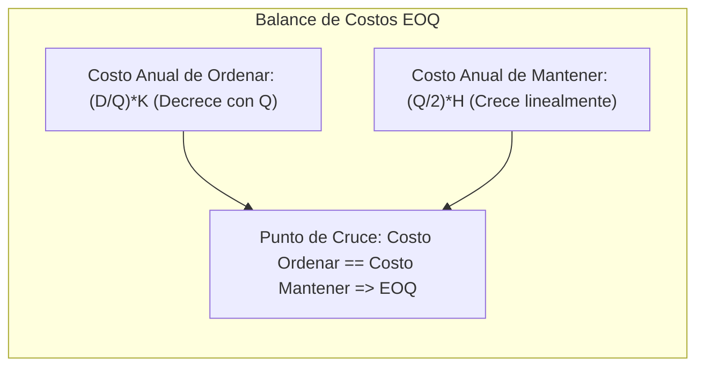

# Introducción

El inventario es capital congelado en los almacenes de una empresa. Mantener demasiado inventario genera costos financieros exorbitantes de almacenamiento, seguros, mermas y obsolescencia. Por el contrario, mantener muy poco inventario obliga a realizar pedidos frecuentes (incrementando costos administrativos y de flete) o peor aún, arriesga paradas de planta por desabastecimiento.

El **Modelo del Lote Económico de Pedido (EOQ - Economic Order Quantity)**, desarrollado originalmente por Ford W. Harris en 1913 y popularizado por R. H. Wilson, determina con precisión matemática el tamaño de lote que minimiza la suma de los costos anuales de emisión de órdenes y de mantenimiento de inventario.

<Callout type="info">
**Supuestos del Modelo EOQ Clásico:**
1. Demanda anual ($D$) constante, conocida y determinística.
2. Tiempo de entrega o reposición del proveedor ($L$) constante y conocido.
3. Reposición instantánea (el lote completo llega en un solo envío).
4. No se permiten faltantes o roturas de stock.
5. El costo de adquisición unitario ($C$) y los costos de ordenar ($K$) y mantener ($H$) son invariables.
</Callout>

## Objetivos de Aprendizaje
- Derivar formalmente la ecuación del EOQ igualando el costo marginal de ordenar y mantener.
- Determinar el número óptimo de órdenes al año y el Punto de Reorden ($ROP$).
- Implementar el algoritmo de decisión económica para evaluar ofertas de proveedores con descuentos por escala o volumen.

---

# 1. Derivación Matemática del Modelo EOQ

Sea:
- $D$: Demanda anual (unidades/año).
- $K$: Costo fijo de emitir y tramitar una orden de compra (\$/orden).
- $C$: Costo unitario de compra del ítem (\$/unidad).
- $h$: Tasa anual de mantenimiento de inventario (% anual del valor del ítem).
- $H = h \cdot C$: Costo anual de mantener una unidad en bodega (\$/unidad-año).
- $Q$: Tamaño del lote de pedido (variable de decisión).

### Función de Costo Total Anual:
$$ TC(Q) = \underbrace{C \cdot D}_{\text{Costo de Compra}} + \underbrace{\frac{D}{Q} \cdot K}_{\text{Costo Anual de Ordenar}} + \underbrace{\frac{Q}{2} \cdot H}_{\text{Costo Anual de Mantener}} $$

Derivando con respecto a $Q$ e igualando a cero:
$$ \frac{dTC}{dQ} = -\frac{D \cdot K}{Q^2} + \frac{H}{2} = 0 $$

Despejando el lote óptimo $Q^*$:
$$ \boxed{Q^* = \sqrt{\frac{2 D K}{H}}} $$



### Métricas Derivadas:
- **Número de órdenes al año:** $N^* = \frac{D}{Q^*}$
- **Tiempo entre órdenes:** $T^* = \frac{Q^*}{D}$ (en años) o $T^* = \frac{365 \cdot Q^*}{D}$ (en días).
- **Punto de Reorden ($ROP$):**
  $$ ROP = d \cdot L $$
  Donde $d = \frac{D}{\text{Días Laborales del Año}}$ es la tasa de consumo diario y $L$ es el tiempo de entrega del proveedor en días.

---

# 2. Descuentos por Cantidad (Price Breaks)

En el comercio industrial B2B, los proveedores ofrecen descuentos si se compran grandes volúmenes. La función de costo unitario $C$ se convierte en una función escalonada.

### Algoritmo de Decisión para Descuentos por Todas las Unidades:
1. Para cada nivel de precio $C_i$, calcular su respectivo $Q_i^* = \sqrt{\frac{2 D K}{h \cdot C_i}}$.
2. Verificar la **factibilidad**: ¿Cae $Q_i^*$ dentro del intervalo de volumen requerido para obtener ese precio?
   - Si $Q_i^*$ es menor que el mínimo requerido para el descuento, ajustar el candidato al **punto de quiebre (límite inferior del rango)**.
   - Si $Q_i^*$ es factible, mantener $Q_i^*$.
3. Calcular el Costo Total Anual $TC(Q)$ para cada candidato factible evaluado (incluyendo el costo de compra $C_i \cdot D$).
4. Seleccionar el tamaño de lote que arroje el **menor Costo Total Global**.

---

# 3. Caso Industrial: Compra de Rodamientos Industriales

Una planta automotriz consume $D = 12,000$ rodamientos al año.
- Costo de gestión de orden y logística de recepción: $K = \$150$ por pedido.
- Costo de mantener inventario: $h = 20\%$ anual del costo del ítem.
- Lead time del proveedor: $L = 5$ días hábiles (asumiendo 250 días laborables/año).

El proveedor ofrece la siguiente tabla de descuentos:
- Rango 1 (1 a 999 unidades): $C_1 = \$20.00$
- Rango 2 (1,000 a 2,999 unidades): $C_2 = \$18.50$
- Rango 3 (3,000 o más unidades): $C_3 = \$17.00$

---

# 4. Implementación en Python: Algoritmo de Descuentos

```python
import math

def eoq_discounts(D, K, h, price_tiers):
    """
    Evalúa las opciones de compra con descuentos por cantidad.
    price_tiers: lista de tuplas (q_min, q_max, C)
    """
    candidates = []
    
    for q_min, q_max, C in price_tiers:
        H = h * C
        # EOQ no restringido para este precio
        q_star = math.sqrt((2 * D * K) / H)
        
        # Ajuste de factibilidad
        if q_star < q_min:
            q_eval = q_min  # Comprar el mínimo necesario para acceder al precio
        elif q_max is not None and q_star > q_max:
            continue  # No es óptimo comprar en este tramo a este precio
        else:
            q_eval = q_star
            
        # Costo total anual
        cost_purchase = C * D
        cost_order = (D / q_eval) * K
        cost_holding = (q_eval / 2) * H
        total_cost = cost_purchase + cost_order + cost_holding
        
        candidates.append({
            "precio": C,
            "q_min": q_min,
            "q_eval": q_eval,
            "c_compra": cost_purchase,
            "c_orden": cost_order,
            "c_manten": cost_holding,
            "costo_total": total_cost
        })
        
    return candidates

# Parámetros del caso
D = 12000
K = 150.0
h = 0.20

tiers = [
    (1, 999, 20.00),
    (1000, 2999, 18.50),
    (3000, None, 17.00)
]

resultados = eoq_discounts(D, K, h, tiers)

print(f"{'Precio Unit':<12} | {'Lote Candidato':<16} | {'C. Compra':<12} | {'C. Ordenar':<12} | {'C. Mantener':<12} | {'Costo Total':<12}")
print("-" * 88)

for r in resultados:
    print(f"${r['precio']:<11.2f} | {r['q_eval']:<16.1f} | ${r['c_compra']:<11.0f} | ${r['c_orden']:<11.0f} | ${r['c_manten']:<11.0f} | ${r['costo_total']:<11.2f}")

optimo = min(resultados, key=lambda x: x['costo_total'])
print("-" * 88)
print(f"🎯 Decisión Óptima: Comprar lotes de {optimo['q_eval']:.0f} unidades al precio de ${optimo['precio']:.2f}")
print(f"   Costo Total Mínimo Anual: ${optimo['costo_total']:.2f}")

# Cálculo del Punto de Reorden (ROP)
dias_laborables = 250
d_diario = D / dias_laborables
L_dias = 5
rop = d_diario * L_dias
print(f"\n📦 Demanda Diaria: {d_diario:.0f} pzs/día | Tiempo de Entrega: {L_dias} días")
print(f"🚨 Punto de Reorden (ROP): Emitir orden de compra exactamente cuando el stock baje a {rop:.0f} unidades.")
```

<Callout type="note">
**Trade-off Estratégico:** Observa que al ordenar 3,000 unidades el costo de mantener inventario aumenta notablemente, pero el ahorro del 15% en el costo base de adquisición ($17 vs $20) genera un beneficio neto abrumador para la empresa.
</Callout>

---

# Autoevaluación

<Quiz
  title="Quiz: Lote Económico (EOQ) y Descuentos"
  questions={[
    {
      id: "q_eoq_1",
      text: "En el modelo clásico de EOQ sin descuentos, ¿qué relación matemática exacta existe entre el costo anual de ordenar y el costo anual de mantener inventario cuando se pide el lote óptimo Q*?",
      options: [
        { id: "a", text: "Son exactamente iguales: (D / Q*) · K = (Q* / 2) · H", isCorrect: true, explanation: "Correcto: El óptimo ocurre en la intersección de ambas curvas de costo, donde el costo marginal de emitir órdenes compensa con precisión el costo de almacenaje." },
        { id: "b", text: "El costo de mantener inventario es el doble del costo de ordenar", isCorrect: false, explanation: "Son estrictamente iguales en el punto óptimo analítico." },
        { id: "c", text: "El costo de ordenar es cero", isCorrect: false, explanation: "Solo sería cero si no se hicieran pedidos en todo el año, lo cual violaría la satisfacción de demanda." }
      ]
    },
    {
      id: "q_eoq_2",
      text: "Si la demanda anual de un producto se cuadruplica (se multiplica por 4) manteniendo todos los costos unitarios constantes, ¿cómo cambia el lote económico óptimo Q*?",
      options: [
        { id: "a", text: "Se duplica (se multiplica por √4 = 2)", isCorrect: true, explanation: "Correcto: Debido a la raíz cuadrada en la fórmula de Wilson Q* = √(2DK/H), si D se multiplica por 4, Q* se multiplica por √4 = 2." },
        { id: "b", text: "Se cuadruplica (se multiplica por 4)", isCorrect: false, explanation: "El modelo EOQ aprovecha economías de escala; el inventario de ciclo crece con la raíz cuadrada, no linealmente." },
        { id: "c", text: "Permanece sin cambios", isCorrect: false, explanation: "El lote óptimo depende directamente de la demanda anual." }
      ]
    },
    {
      id: "q_eoq_3",
      text: "Al evaluar un descuento por escala donde el lote óptimo teórico calculado Q* es de 450 unidades, pero el proveedor exige un pedido mínimo de 1,000 unidades para otorgar el menor precio, ¿cuál es el procedimiento correcto?",
      options: [
        { id: "a", text: "Evaluar el costo total anual evaluando exactamente Q = 1,000 unidades y compararlo contra el mejor costo de los tramos inferiores", isCorrect: true, explanation: "Correcto: La función de costo es monótonamente creciente a la derecha de Q*; por tanto, el punto más barato dentro del intervalo con descuento es su cota inferior (1,000)." },
        { id: "b", text: "Descartar de inmediato la oferta del proveedor por ser un lote inviable", isCorrect: false, explanation: "El descuento unitario en el precio de compra frecuentemente compensa con creces el sobrecosto de almacenaje." },
        { id: "c", text: "Pedir 450 unidades y exigirle legalmente al proveedor que respete el descuento", isCorrect: false, explanation: "Los términos comerciales contractuales establecen los umbrales mínimos de volumen." }
      ]
    }
  ]}
/>
