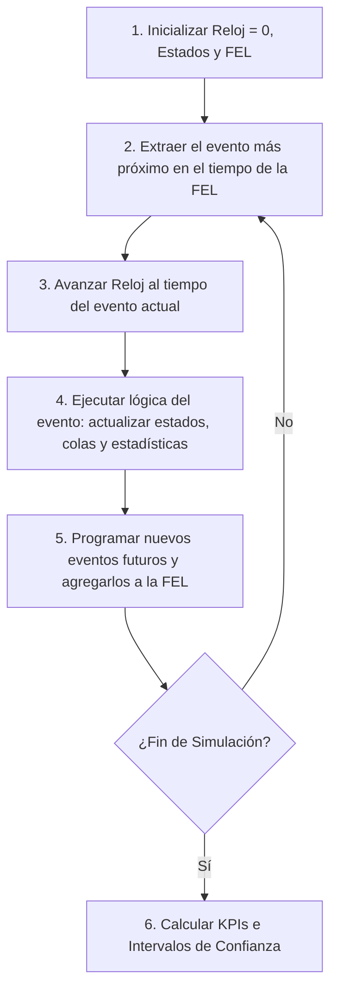

# Introducción

Mientras que la simulación de Monte Carlo tradicional evalúa funciones estáticas o instantáneas en el tiempo, la **Simulación de Eventos Discretos (DES - Discrete-Event Simulation)** modela la operación dinámica de un sistema a medida que evoluciona cronológicamente.

En un modelo DES, el estado del sistema cambia únicamente en **puntos discretos del tiempo** donde ocurre un "evento" (la llegada de una pieza, la culminación de un maquinado, el paro por avería mecánica). Entre dos eventos consecutivos, absolutamente nada cambia en el sistema, lo que permite al reloj computacional "saltar" instantáneamente de un evento al siguiente, acelerando semanas de operación fabril en pocos segundos de cómputo.

<Callout type="info">
**Componentes Fundamentales de un Sistema DES:**
- **Entidades:** Ítems dinámicos que fluyen por el sistema (ej. piezas, clientes, pedidos).
- **Recursos:** Elementos de capacidad finita que prestan servicio (ej. operarios, robots, tornos CNC).
- **Colas (Buffers):** Almacenamiento temporal donde las entidades esperan la liberación de recursos.
- **Reloj de Simulación:** Variable que registra el avance del tiempo simulado.
- **Lista de Eventos Futuros (FEL - Future Event List):** Cola de prioridad cronológica ordenada con todos los eventos programados para ocurrir.
</Callout>

## Objetivos de Aprendizaje
- Dominar el bucle principal de avance temporal por eventos discretos.
- Diferenciar el estado transitorio (sesgo de inicio) del estado estacionario y aplicar réplicas independientes.
- Construir intervalos de confianza estadísticos para las métricas de rendimiento ($KPIs$) y dimensionar el número requerido de corridas.

---

# 1. Arquitectura del Bucle de Simulación de Eventos Discretos

El núcleo de todo motor de simulación industrial (como Arena, AnyLogic, FlexSim o SimPy) sigue un ciclo algorítmico determinístico:



---

# 2. Análisis Estadístico de la Salida de Simulación

Dado que la simulación es un experimento estocástico computacional, los resultados de una sola corrida no son determinísticos sino realizaciones de variables aleatorias. 

### A. Período de Calentamiento (Warm-up Period):
Los sistemas fabriles reales casi nunca arrancan completamente vacíos. Para estimar el comportamiento en estado estable sin sesgo artificial por inicio frío, se descartan las estadísticas recolectadas durante las primeras horas de simulación ($T_0$).

### B. Método de Réplicas Independientes:
Se ejecutan $R$ corridas idénticas del modelo utilizando secuencias independientes de números pseudoaleatorios (diferentes semillas).
Sea $Y_r$ el valor del KPI (ej. piezas producidas por hora) en la réplica $r = 1, \dots, R$.

El estimador puntual es la media muestral:
$$ \bar{Y} = \frac{1}{R} \sum_{r=1}^R Y_r $$

Y su desviación estándar muestral entre réplicas es:
$$ S_Y = \sqrt{\frac{1}{R - 1} \sum_{r=1}^R (Y_r - \bar{Y})^2} $$

### Intervalo de Confianza al $(1 - \alpha) \times 100\%$:
$$ \boxed{\bar{Y} \pm t_{\alpha/2, R-1} \cdot \frac{S_Y}{\sqrt{R}}} $$

Donde $t_{\alpha/2, R-1}$ es el valor crítico de la distribución t de Student con $R - 1$ grados de libertad.

---

# 3. Caso Industrial: Celda de Manufactura de Dos Estaciones en Serie

Modelamos una línea de producción compuesta por dos máquinas secuenciales:
- **Estación 1 (Torneado):** Tiempo de ciclo uniforme continuo entre 3.0 y 5.0 minutos.
- **Buffer Intermedio:** Capacidad ilimitada entre Estación 1 y Estación 2.
- **Estación 2 (Fresado y Rectificado):** Tiempo de ciclo normal con media $\mu = 4.2$ minutos y $\sigma = 0.6$ minutos.
- **Llegadas de Materia Prima:** Tiempos entre arribos exponenciales con media de 4.5 minutos ($\lambda = 13.33$ piezas/hora).

Objetivo: Simular 8 horas de operación (480 minutos), ejecutar 20 réplicas independientes y calcular el intervalo de confianza al 95% para la tasa de producción total y el WIP medio.

---

# 4. Implementación en Python: Motor DES Completo con Réplicas

```python
import heapq
import numpy as np
from scipy import stats

class ManufacturingCellSim:
    def __init__(self, sim_time=480.0):
        self.sim_time = sim_time
        
    def run_replication(self, seed=None):
        if seed is not None:
            np.random.seed(seed)
            
        clock = 0.0
        # FEL (Priority Queue): tuplas de (tiempo_evento, tipo_evento, entidad_id)
        fel = []
        entity_id_counter = 0
        
        # Estados del sistema
        m1_busy = False
        m2_busy = False
        q1 = []  # Cola previa a M1
        q2 = []  # Buffer entre M1 y M2
        
        # Estadísticas acumuladas
        completed_parts = 0
        wip_area = 0.0
        last_event_time = 0.0
        current_wip = 0
        
        # Programar primera llegada
        t_first = np.random.exponential(4.5)
        entity_id_counter += 1
        heapq.heappush(fel, (t_first, "ARRIVAL", entity_id_counter))
        
        while fel:
            clock, event_type, eid = heapq.heappop(fel)
            
            if clock > self.sim_time:
                break
                
            # Actualizar área de WIP en el tiempo
            dt = clock - last_event_time
            wip_area += current_wip * dt
            last_event_time = clock
            
            if event_type == "ARRIVAL":
                current_wip += 1
                # Programar siguiente llegada
                next_arr = clock + np.random.exponential(4.5)
                entity_id_counter += 1
                heapq.heappush(fel, (next_arr, "ARRIVAL", entity_id_counter))
                
                # Procesar en M1 si está libre
                if not m1_busy:
                    m1_busy = True
                    t_serv = np.random.uniform(3.0, 5.0)
                    heapq.heappush(fel, (clock + t_serv, "DEP_M1", eid))
                else:
                    q1.append(eid)
                    
            elif event_type == "DEP_M1":
                # Salida de M1 e ingreso a M2 o buffer
                if not m2_busy:
                    m2_busy = True
                    t_serv2 = max(0.5, np.random.normal(4.2, 0.6))
                    heapq.heappush(fel, (clock + t_serv2, "DEP_M2", eid))
                else:
                    q2.append(eid)
                    
                # Atender siguiente en cola de M1
                if q1:
                    next_eid = q1.pop(0)
                    t_serv = np.random.uniform(3.0, 5.0)
                    heapq.heappush(fel, (clock + t_serv, "DEP_M1", next_eid))
                else:
                    m1_busy = False
                    
            elif event_type == "DEP_M2":
                completed_parts += 1
                current_wip -= 1
                
                # Atender siguiente en cola de M2
                if q2:
                    next_eid = q2.pop(0)
                    t_serv2 = max(0.5, np.random.normal(4.2, 0.6))
                    heapq.heappush(fel, (clock + t_serv2, "DEP_M2", next_eid))
                else:
                    m2_busy = False

        avg_wip = wip_area / clock if clock > 0 else 0
        throughput_hr = (completed_parts / (clock / 60.0))
        return completed_parts, throughput_hr, avg_wip

# Ejecución de 20 réplicas independientes
NUM_REPLICAS = 20
sim = ManufacturingCellSim(sim_time=480.0)

results_throughput = []
results_wip = []

for r in range(NUM_REPLICAS):
    parts, th, wip = sim.run_replication(seed=100 + r)
    results_throughput.append(th)
    results_wip.append(wip)

# Intervalo de confianza al 95% para Throughput
th_mean = np.mean(results_throughput)
th_std = np.std(results_throughput, ddof=1)
t_crit = stats.t.ppf(0.975, df=NUM_REPLICAS - 1)
half_width_th = t_crit * (th_std / np.sqrt(NUM_REPLICAS))

wip_mean = np.mean(results_wip)
wip_std = np.std(results_wip, ddof=1)
half_width_wip = t_crit * (wip_std / np.sqrt(NUM_REPLICAS))

print("=== ANÁLISIS ESTADÍSTICO DE 20 RÉPLICAS INDEPENDIENTES (DES) ===")
print(f"Rendimiento Medio (Throughput): {th_mean:.2f} ± {half_width_th:.2f} piezas/hora")
print(f"  -> Intervalo Confianza 95%  : [{th_mean - half_width_th:.2f}, {th_mean + half_width_th:.2f}]")
print(f"\nInventario en Proceso (WIP)   : {wip_mean:.2f} ± {half_width_wip:.2f} piezas")
print(f"  -> Intervalo Confianza 95%  : [{wip_mean - half_width_wip:.2f}, {wip_mean + half_width_wip:.2f}]")
```

---

# Autoevaluación

<Quiz
  title="Quiz: Simulación de Eventos Discretos e Inferencia Estadística"
  questions={[
    {
      id: "q_des_1",
      text: "¿Por qué el mecanismo de avance temporal por eventos (Next-Event Time Advance) es computacionalmente más eficiente que el avance a intervalos fijos de tiempo (Fixed-Increment Time Advance)?",
      options: [
        { id: "a", text: "Porque salta instantáneamente el reloj de simulación directo al momento exacto del próximo evento futuro programado, omitiendo por completo los períodos vacíos de inactividad", isCorrect: true, explanation: "Correcto: Si no ocurren eventos durante 50 minutos, el algoritmo no pierde ciclos de cómputo evaluando segundo a segundo en vano; salta directamente al minuto 50." },
        { id: "b", text: "Porque no requiere generar números aleatorios", isCorrect: false, explanation: "Ambos métodos requieren muestreo estocástico de variables aleatorias." },
        { id: "c", text: "Porque solo funciona para sistemas con un único servidor", isCorrect: false, explanation: "Aplica universalmente a redes con miles de máquinas y buffers." }
      ]
    },
    {
      id: "q_des_2",
      text: "¿Por qué es un grave error de ingeniería reportar los resultados de una sola corrida de simulación como si fueran valores determinísticos exactos del proceso real?",
      options: [
        { id: "a", text: "Porque una sola corrida es únicamente una muestra de tamaño n = 1 sujeta a alta variabilidad aleatoria; se requieren múltiples réplicas independientes para construir intervalos de confianza estadísticamente rigurosos", isCorrect: true, explanation: "Correcto: Sin réplicas ni intervalos de confianza, no es posible distinguir si una mejora observada se debe a un cambio de diseño o a mera suerte en la semilla aleatoria." },
        { id: "b", text: "Porque las computadoras siempre cometen errores de redondeo en la primera corrida", isCorrect: false, explanation: "El problema es la variabilidad estocástica inherente al sistema, no la precisión de coma flotante de la CPU." },
        { id: "c", text: "Porque el software de simulación se apaga automáticamente tras una corrida", isCorrect: false, explanation: "Incorrecto." }
      ]
    },
    {
      id: "q_des_3",
      text: "En un estudio de simulación de manufactura, ¿cuál es el propósito metodológico fundamental de descartar las primeras horas de datos mediante el denominado 'período de calentamiento' (warm-up)?",
      options: [
        { id: "a", text: "Eliminar el sesgo de inicialización provocado por arrancar el modelo con la fábrica artificialmente vacía e inactiva, asegurando que las métricas reflejen el régimen operativo estable real", isCorrect: true, explanation: "Correcto: Al inicio los buffers están vacíos y las máquinas libres, lo que subestimaría el tiempo de espera real si se incluyeran en el promedio global." },
        { id: "b", text: "Permitir que el procesador de la computadora alcance su temperatura óptima de operación", isCorrect: false, explanation: "Es un concepto metodológico puramente estadístico de cadenas de Markov y procesos estocásticos." },
        { id: "c", text: "Reducir la memoria RAM ocupada por el sistema operativo", isCorrect: false, explanation: "No guarda relación con la gestión de memoria RAM." }
      ]
    }
  ]}
/>
